# SMARTGRID-X
## Occupancy-aware energy-waste and anomaly analysis of the I-BLEND campus dataset

**Course:** MD3135 — Data Science
**Programme:** T.Y. B.Tech, Vishwakarma Institute of Technology, Pune
**Academic year:** 2025–26

**Team**

| Role | Owns | Name |
|---|---|---|
| Data lead | Phase 1: loading, merging, cleaning, data-quality summary | *(add name)* |
| Analysis lead | Phases 2–3: statistics, EDA, PCA | *(add name)* |
| Modelling lead | Phase 4: regression and evaluation | *(add name)* |
| Insight lead | Phases 5–6: wasted energy, anomaly experiment | *(add name)* |
| Delivery lead | Phase 7: dashboard, report, presentation | *(add name)* |

---

> **How to read this report.** It is written to stand on its own. You do not need
> to open the notebooks to follow it. Every number, table and chart in it was
> produced by code in `notebooks/`, and anything not yet computed says
> "pending Phase N" rather than being guessed at.

---

## 1. Abstract

<!-- BEGIN:abstract -->
pending Phase 7 — the abstract is rewritten at the end of the project with the
real findings, so that it reports results rather than intentions.

*Provisional statement of intent:* this project measures how much electricity
seven buildings on the IIIT-Delhi campus consume while they are close to empty,
using the public I-BLEND dataset of 1-minute electrical readings paired with
10-minute WiFi-derived occupancy counts over February 2014 – November 2017. It
then tests whether an anomaly detector that knows about occupancy outperforms one
that only knows the time of day.
<!-- END:abstract -->

---

## 2. Introduction

### 2.1 What data science is

Data science is the practice of turning recorded observations into decisions. It
sits on three legs: the **domain** the data comes from, the **statistics** needed
to say what the data does and does not support, and the **computing** needed to
handle data at a size no person could read. A data scientist's job is not to
produce a model; it is to answer a question in a way that survives scrutiny —
which means being as clear about the data's flaws as about the result.

This project is a small but complete example of that cycle: a real question
(*how much electricity does a near-empty building use?*), a real and imperfect
dataset, cleaning that has to be justified, a measurement, a model, an experiment,
and an honest account of what the answer does not cover.

### 2.2 Big data, the hype, and getting past it

For most of the 2010s "big data" was sold as a promise that volume itself creates
insight — collect everything, and answers will emerge. The reality is duller and
more useful. Our dataset is about 1.6 GB, which is large enough to break a naive
script on a laptop but far too small to be interesting merely for its size. What
makes it valuable is not the volume but the **resolution and the pairing**: a
reading every minute, for four years, alongside a count of how many devices were
in the building.

Getting past the hype means three practical commitments, all visible in this
project:

- **Size is an engineering problem, not a source of insight.** We handle 1.6 GB by
  reading one building at a time and caching a 10-minute summary. That is
  plumbing, and it is not the contribution.
- **More rows do not fix a biased measurement.** Our occupancy sensor counts WiFi
  devices, not people. Four years of it is still four years of a biased count, and
  no amount of data corrects that — only stating it does.
- **The question comes before the method.** Everything in this report that does
  not serve one of the three research questions below was cut.

### 2.3 Datafication, with smart meters as the example

**Datafication** is the process by which an activity that was previously invisible
becomes a stream of records that can be counted, compared and acted on. Electricity
is the textbook case. For a century, a building's energy use was a single number
read off a dial once a month by a person with a clipboard: enough to send a bill,
useless for understanding behaviour.

A smart meter datafies the same activity. Reading the same feeder every minute
turns "the campus used 40,000 units last month" into a time series in which you can
see the lights come on, a chiller cycle, an exam week, a vacation. The activity has
not changed; its *visibility* has. The I-BLEND dataset is exactly this: campus
electricity use, datafied at 1-minute resolution for 4.4 years.

The second datafication in this project is subtler and more debatable. IIIT-Delhi's
WiFi access points log which devices are associated with them. That log was created
for network operations, but it can be re-read as a **proxy for occupancy** — turning
"who is in the building" into data as a by-product of a system built for something
else. This is characteristic of datafication, and so is its characteristic flaw:
the proxy is not the thing. A phone left charging in an empty room is still counted.
Section 10 treats this as a limitation rather than a detail.

Datafication is what makes this project possible, and its imperfection is what makes
the project honest.

### 2.4 The current landscape, and where energy analytics sits in it

Contemporary data science runs on cheap storage, mature open-source tooling
(`pandas`, `scikit-learn`), and a shift from bespoke statistics toward reusable
pipelines. Energy analytics has followed the same path: from monthly billing
analysis, to load forecasting, to non-intrusive load monitoring and automated
fault detection in buildings. Public benchmark datasets — I-BLEND among them —
are the infrastructure of that shift, because they let different groups test
different methods on the same data. This project is a user of that infrastructure:
standard methods, applied to a dataset in a way it has not been applied before.

### 2.5 Problem statement

Buildings consume electricity when nobody is using them. Lights, air conditioning,
idle equipment and always-on infrastructure continue to draw power through nights,
weekends and vacations. On a university campus this is plausibly a large fraction
of total consumption, but it is rarely measured, because measuring it requires two
things at once: fine-grained energy data **and** some knowledge of whether anyone
was there.

The I-BLEND dataset has both. It has not, as far as we can find, been used to ask
this question.

### 2.6 Research questions

1. **MAIN — Waste.** What percentage of each building's energy is consumed during
   low-occupancy periods?
2. **Prediction.** How well do occupancy and time of day predict a building's
   power, using simple and multiple linear regression?
3. **Detection.** Does an anomaly detector that uses time *and* occupancy beat one
   that uses time alone, tested on injected anomalies with known locations?

### 2.7 Novelty claim

> **This is the first occupancy-aware energy-waste and anomaly analysis of I-BLEND.**

We state this precisely, because it is a modest claim and overstating it would be
dishonest. The *methods* used here — threshold-based low-occupancy accounting,
linear regression baselines, residual Z-score anomaly detection, PCA day
clustering — are all standard and none is invented here. Measuring energy used in
unoccupied buildings has been done before, in other buildings (Section 3).

What we could not find published is the **application to this dataset**: using
I-BLEND's own WiFi occupancy stream to quantify, per building, how much of the
campus's electricity is consumed while it is close to empty, together with a
threshold-sensitivity curve and a controlled test of whether occupancy improves
automated anomaly detection. That combination is the contribution.

---

## 3. Related work

**Rashid, Singh & Singh (2019), *I-BLEND, a campus-scale commercial and residential
buildings electrical energy dataset*, Scientific Data 6:190015.**
The dataset paper. It describes the collection setup — Schneider EM6400 panel
meters at building level, Cisco access points for occupancy — documents the file
formats, and validates the data. Its purpose is to publish a resource, not to
analyse waste. *How we differ:* we use the dataset it publishes to answer a
question it does not ask, and we quantify the data-quality problems it flags
(Section 4) rather than only noting them.

**Rashid & Singh (2018), *Monitor: an abnormality detection approach in buildings
energy consumption*.**
Prior work on this same campus. It clusters daily load profiles and detects days
whose shape is abnormal, using energy data alone. *How we differ:* our detector
question is explicitly comparative — does adding occupancy help? — and is evaluated
against injected anomalies with known ground-truth locations, which lets us report
precision and recall rather than only illustrative examples. Our PCA day-clustering (Phase 3)
overlaps with this work and is therefore presented as *supporting analysis, not as
a novelty claim*.

**Mishra, Lone & Mishra (2024), *DECODE: Data-driven Energy Consumption Prediction
leveraging Historical Data and Environmental Factors in Buildings*.**
Forecasts consumption on I-BLEND, including occupancy among its inputs. *How we
differ:* DECODE's objective is predictive accuracy. Ours is accounting and
detection — we use regression as a *baseline of expected consumption* against which
waste and anomalies are measured, not as an end in itself.

**Masoso & Grobler (2010), *The dark side of occupants' behaviour on building
energy use*, Energy and Buildings 42(2).**
Audited commercial buildings in Botswana and South Africa and found that **56% of
total energy was consumed outside working hours**, more than during them. *How we
differ:* their "unoccupied" is defined by the clock (outside office hours); ours is
defined by a measured occupancy signal, which catches an empty building at 3 p.m.
on a vacation day that a clock-based rule would call occupied. Their figure is our
main external comparison point for commercial buildings.

**Anderson, Song, Lee & Tian (2015), *Longitudinal analysis of normalized energy
consumption in university dormitories*, Energy and Buildings.**
Found **27.5–31.5% of dormitory energy consumed while unoccupied**. *How we
differ:* same measurement idea, different campus and climate (Delhi, with heavy
summer cooling), and a measured rather than assumed occupancy signal. This is our
comparison point for the two hostel buildings.

**Lawrence Berkeley National Laboratory (2016), baseline energy models using
occupancy data.**
Tested whether adding occupancy information improves building energy baseline
models, and found the improvement modest. *How we differ:* we run the equivalent
comparison on I-BLEND (models B versus C in Phase 4) and report the result
whichever way it falls — a null result here is a genuine finding, not a failure,
and it directly informs research question 3.

---

## 4. Dataset and data quality

### 4.1 Source

The **I-BLEND** dataset (Rashid, Singh & Singh, *Scientific Data*, 2019) records
electricity use across the IIIT-Delhi campus. It is published on figshare under
DOI [10.6084/m9.figshare.c.3893581](https://doi.org/10.6084/m9.figshare.c.3893581).
It contains two parts, which this project joins together:

- **Energy** — 1-minute readings from Schneider EM6400 panel meters on nine
  building feeders and three transformers, August 2013 to December 2017. Columns:
  `timestamp` (UNIX seconds), `power` (W), `current` (A), `voltage` (V),
  `frequency` (Hz), `power_factor`.
- **Occupancy** — 10-minute counts of devices associated with each building's Cisco
  WiFi access points, February 2014 to November 2017. Columns: `timestamp`,
  `occupancy_count`.

The dataset readme is explicit that UNIX timestamps must be converted using the
`Asia/Kolkata` timezone (UTC+05:30); every notebook in this project does so.

### 4.2 Buildings and the meter-to-occupancy mapping

Joining the two halves of the dataset depends entirely on this mapping, which comes
from the two `Readme.txt` files shipped with the data. Both dormitories have two
meters — a mains supply and a UPS (backup) supply — which we keep separate as well
as summing, because which supply keeps running when rooms empty out is one of the
questions in Phase 5.

<!-- BEGIN:phase0_mapping -->
| building | label | occupancy file | energy meters | kind |
|---|---|---|---|---|
| Academic | Academic Building | ACB.csv | acad_build_mains.csv | commercial |
| Boys_Hostel | Boys Dormitory | BH.csv | boys_hostel_mains.csv, boys_hostel_ups.csv | residential |
| Girls_Hostel | Girls Dormitory | GH.csv | girls_hostel_mains.csv, girls_hostel_ups.csv | residential |
| Mess | Dining Building (Mess) | DB.csv | mess_build_mains.csv | commercial |
| Library | Library Building | LB.csv | library_build_mains.csv | commercial |
| Lecture | Lecture Building | LCB.csv | lecture_build_mains.csv | commercial |
| Facilities | Facilities Building | SRB.csv | facilities_build_mains.csv | commercial |
<!-- END:phase0_mapping -->

### 4.3 What is in the folder

<!-- BEGIN:phase0_file_inventory -->
| folder | file | size mb |
|---|---|---|
| energy_dataset | all_buildings_power.csv | 187.81 |
| energy_dataset | acad_build_mains.csv | 125.16 |
| energy_dataset | girls_hostel_ups.csv | 123.82 |
| energy_dataset | mess_build_mains.csv | 111.26 |
| energy_dataset | facilities_build_mains.csv | 110.70 |
| energy_dataset | transformer_2.csv | 95.68 |
| energy_dataset | transformer_3.csv | 95.17 |
| energy_dataset | boys_hostel_ups.csv | 93.18 |
| energy_dataset | library_build_mains.csv | 92.70 |
| energy_dataset | girls_hostel_mains.csv | 89.95 |
| energy_dataset | boys_hostel_mains.csv | 86.46 |
| energy_dataset | all_transformer_power.csv | 85.74 |
| energy_dataset | data_present_status_buildings.csv | 83.76 |
| energy_dataset | lecture_build_mains.csv | 72.76 |
| energy_dataset | transformer_1.csv | 66.01 |
| energy_dataset | data_present_status_transformers.csv | 53.45 |
| energy_dataset | .DS_Store | 0.01 |
| energy_dataset | Readme.txt | 0 |
| IIITD_occupancy_dataset | BH.csv | 3.22 |
| IIITD_occupancy_dataset | GH.csv | 3.16 |
| IIITD_occupancy_dataset | ACB.csv | 3.12 |
| IIITD_occupancy_dataset | DB.csv | 3.07 |
| IIITD_occupancy_dataset | LB.csv | 2.94 |
| IIITD_occupancy_dataset | SRB.csv | 2.59 |
| IIITD_occupancy_dataset | LCB.csv | 2.54 |
| IIITD_occupancy_dataset | .DS_Store | 0.01 |
| IIITD_occupancy_dataset | Readme.txt | 0 |

Total: **1,594 MB** across 27 files.
<!-- END:phase0_file_inventory -->

### 4.4 Coverage of each energy meter

A file having 2.2 million rows does not mean it has 2.2 million consecutive
minutes of data. For each meter we compare the readings actually present against
the number that should exist between its first and last timestamp.

<!-- BEGIN:phase0_energy_profile -->
| meter | label | rows | first | last | span days | row coverage pct | gaps over 1min | largest gap hours |
|---|---|---|---|---|---|---|---|---|
| acad_mains | Academic | 2,269,530 | 2013-08-10 00:00:00+05:30 | 2017-12-31 23:59:00+05:30 | 1,605 | 98.20 | 489 | 254.70 |
| boys_mains | Boys_Hostel | 1,671,546 | 2013-08-10 00:00:00+05:30 | 2017-12-31 23:59:00+05:30 | 1,605 | 72.32 | 9,149 | 4,987.80 |
| boys_ups | Boys_Hostel | 1,688,044 | 2013-08-10 00:00:00+05:30 | 2017-12-31 23:59:00+05:30 | 1,605 | 73.04 | 9,783 | 4,987.80 |
| girls_mains | Girls_Hostel | 1,653,053 | 2013-08-10 00:00:00+05:30 | 2017-12-31 23:59:00+05:30 | 1,605 | 71.52 | 616 | 5,311 |
| girls_ups | Girls_Hostel | 2,300,745 | 2013-08-10 00:00:00+05:30 | 2017-12-31 23:59:00+05:30 | 1,605 | 99.55 | 563 | 32.10 |
| library_mains | Library | 1,713,637 | 2013-08-10 00:00:00+05:30 | 2017-12-31 23:59:00+05:30 | 1,605 | 74.14 | 639 | 4,890.80 |
| mess_mains | Mess | 2,013,090 | 2013-09-24 00:00:00+05:30 | 2017-12-31 23:59:00+05:30 | 1,560 | 89.61 | 1,074 | 1,465.20 |
| lecture_mains | Lecture | 2,269,309 | 2013-08-10 00:00:00+05:30 | 2017-12-31 23:59:00+05:30 | 1,605 | 98.19 | 719 | 254.70 |
| facilities_mains | Facilities | 2,048,910 | 2013-11-15 00:00:00+05:30 | 2017-12-31 23:59:00+05:30 | 1,508 | 94.35 | 3,191 | 1,054.80 |
<!-- END:phase0_energy_profile -->

### 4.5 Data-quality measurements per meter

<!-- BEGIN:phase0_energy_quality -->
| meter | power mean w | power max w | power zero pct | pf negative pct | pf min | pf max | voltage min | voltage max | voltage out of range pct | current na pct |
|---|---|---|---|---|---|---|---|---|---|---|
| acad_mains | 27,785.80 | 95,786.30 | 0.29 | 13.78 | -1.00 | 1 | 0 | 269.17 | 0.00 | 9.29 |
| boys_mains | 17,488 | 97,663.90 | 0.01 | 43.64 | -1.00 | 1 | 0 | 281.76 | 0.01 | 12.56 |
| boys_ups | 13,927.40 | 47,212.10 | 0 | 47.46 | -1.00 | 1 | 0 | 277.74 | 0.08 | 12.45 |
| girls_mains | 7,315.90 | 20,895.90 | 0 | 67.55 | -1.00 | 1 | 0 | 280.90 | 0.00 | 11.38 |
| girls_ups | 6,881.30 | 18,126.80 | 0.01 | 66.05 | -1.00 | 1 | 0 | 277.68 | 0.02 | 9.12 |
| library_mains | 9,074.70 | 99,208.90 | 0 | 58.08 | -1.00 | 1 | 0 | 270.41 | 0.00 | 12.34 |
| mess_mains | 22,195.30 | 142,442.10 | 0 | 0.05 | -1.00 | 1 | 209.60 | 270.45 | 0 | 7.19 |
| lecture_mains | 641.70 | 26,703.10 | 81.70 | 0.01 | -1.00 | 1 | 119.51 | 254.17 | 0 | 9.29 |
| facilities_mains | 10,458.90 | 139,437.10 | 0 | 3.14 | -1.00 | 1 | 0 | 268.56 | 0.00 | 3.24 |
<!-- END:phase0_energy_quality -->

### 4.6 Coverage of each occupancy file

<!-- BEGIN:phase0_occupancy_profile -->
| building | file | rows | first | last | span days | row coverage pct | aligned to 10min |
|---|---|---|---|---|---|---|---|
| Academic | ACB.csv | 179,701 | 2014-02-16 00:20:00+05:30 | 2017-11-03 23:50:00+05:30 | 1,357 | 91.96 | True |
| Boys_Hostel | BH.csv | 179,849 | 2014-02-16 00:10:00+05:30 | 2017-11-03 23:50:00+05:30 | 1,357 | 92.04 | True |
| Girls_Hostel | GH.csv | 179,681 | 2014-02-16 00:20:00+05:30 | 2017-11-03 23:50:00+05:30 | 1,357 | 91.95 | True |
| Mess | DB.csv | 178,427 | 2014-02-16 00:30:00+05:30 | 2017-11-03 23:50:00+05:30 | 1,357 | 91.31 | True |
| Library | LB.csv | 173,006 | 2014-02-16 00:20:00+05:30 | 2017-11-03 23:50:00+05:30 | 1,357 | 88.54 | True |
| Lecture | LCB.csv | 151,516 | 2014-02-16 01:50:00+05:30 | 2017-11-03 23:50:00+05:30 | 1,357 | 77.54 | True |
| Facilities | SRB.csv | 157,649 | 2014-07-10 12:00:00+05:30 | 2017-11-03 23:50:00+05:30 | 1,213 | 90.29 | True |
<!-- END:phase0_occupancy_profile -->

### 4.7 Occupancy distribution — and why "empty" is not measurable

<!-- BEGIN:phase0_occupancy_distribution -->
| building | occ min | occ p05 | occ median | occ mean | occ p95 | occ max | low occ threshold | pct rows at or below threshold |
|---|---|---|---|---|---|---|---|---|
| Academic | 1 | 11 | 44 | 78.40 | 257 | 505 | 12.85 | 6.51 |
| Boys_Hostel | 1 | 29 | 221 | 222.10 | 421 | 614 | 21.05 | 4.13 |
| Girls_Hostel | 1 | 11 | 97 | 95.70 | 178 | 275 | 8.90 | 4.02 |
| Mess | 1 | 4 | 44 | 58.50 | 174 | 340 | 8.70 | 12.23 |
| Library | 1 | 2 | 21 | 41.70 | 160 | 498 | 8 | 27.30 |
| Lecture | 1 | 1 | 6 | 39.90 | 209 | 498 | 10.45 | 60.39 |
| Facilities | 1 | 1 | 5 | 6.60 | 18 | 47 | 0.90 | 0 |
<!-- END:phase0_occupancy_distribution -->

<!-- BEGIN:phase0_occupancy_note -->
**The single most important finding in exploration: occupancy never reaches zero.**
The minimum count in every one of the seven buildings is **1**, not 0. This is the
WiFi over-counting the dataset authors warn about -- idle phones and laptops stay
associated with an access point long after their owner has left. The consequence is
structural, not cosmetic: *the main research question cannot be phrased as "energy
used while the building is empty", because no such reading exists in this dataset.*

It must instead be "energy used while occupancy is **low**", against a threshold we
state openly. We use a threshold relative to each building's own scale:
**low occupancy = occupancy at or below 5% of that building's
95th-percentile occupancy.** An absolute cut-off would be
meaningless across buildings whose normal populations differ by a factor of twenty.

Two buildings do not fit the standard recipe, and both are reported rather than
quietly dropped:

- **Facilities (SRB)** is small: its occupancy runs 1 to
  47 with a 95th percentile of 18, so the
  threshold works out to **0.90** -- below its own
  minimum observed count of 1. **No reading qualifies**
  (0.00% of rows). We keep the identical
  rule for every building rather than bending the definition for one, report this
  cell honestly as "no qualifying intervals", and read Facilities off the
  threshold-sensitivity curve in Phase 5 instead.
- **Lecture (LCB)** has 60.4% of its
  readings under the threshold, and its meter reads exactly 0 W for
  81.7% of the record. Its waste figure is therefore computed only
  over the periods when the meter was demonstrably alive, with the coverage
  reported alongside.

Reassuringly, **every occupancy timestamp sits exactly on a 10-minute boundary**,
so energy and occupancy line up without any fuzzy time matching.
<!-- END:phase0_occupancy_note -->

### 4.8 Completeness over time

<!-- BEGIN:phase0_coverage_figure -->
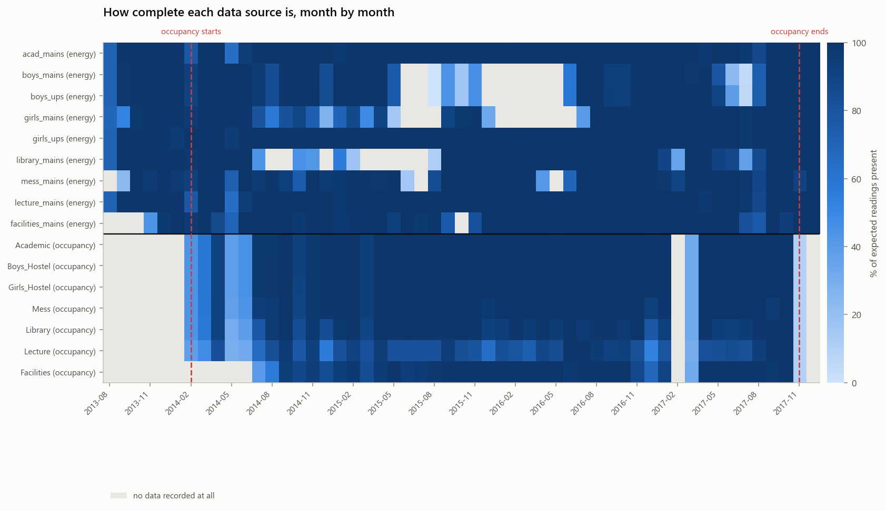

*The record is far patchier than the row counts suggest: the Boys hostel, Girls mains and Library meters each lose several consecutive months entirely, and the occupancy block (below the black line) exists only between the two dashed lines.*
<!-- END:phase0_coverage_figure -->

### 4.9 Missing-data heatmap from the authors' own status file

<!-- BEGIN:phase1_missing_heatmap -->
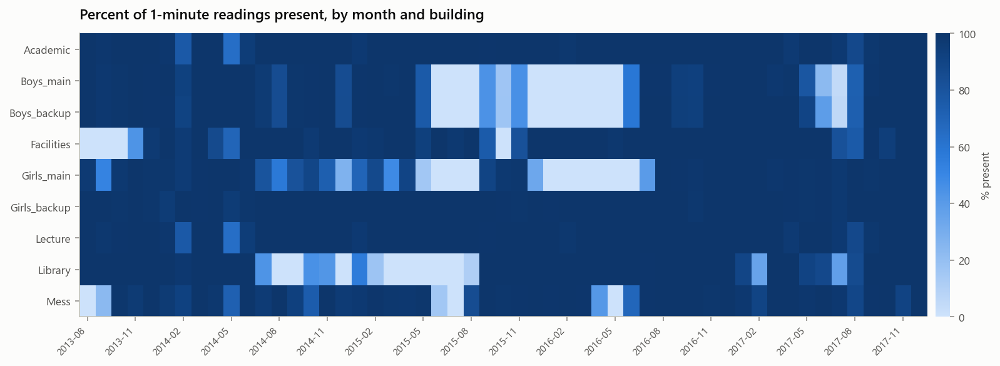

*Built from the authors' own data_present_status_buildings.csv. The Girls mains meter loses most of a year across 2015-16, the Boys meters several months in the same period, and the Library a long stretch in 2014-15.*

| building | month | pct present |
|---|---|---|
| Boys_main | 2015-06 | 0 |
| Boys_main | 2015-07 | 0 |
| Boys_main | 2015-08 | 0 |
| Boys_main | 2015-09 | 44.30 |
| Boys_main | 2015-10 | 16.40 |
| Boys_main | 2015-11 | 45.60 |
| Boys_main | 2015-12 | 0 |
| Boys_main | 2016-01 | 0 |
| Boys_main | 2016-02 | 0 |
| Boys_main | 2016-03 | 0 |
| Boys_main | 2016-04 | 0 |
| Boys_main | 2016-05 | 0 |
| Boys_main | 2017-06 | 22.80 |
| Boys_main | 2017-07 | 4 |
| Boys_backup | 2015-06 | 0 |
| Boys_backup | 2015-07 | 0 |
| Boys_backup | 2015-08 | 0 |
| Boys_backup | 2015-09 | 44.30 |
| Boys_backup | 2015-10 | 16.40 |
| Boys_backup | 2015-11 | 45.60 |
| Boys_backup | 2015-12 | 0 |
| Boys_backup | 2016-01 | 0 |
| Boys_backup | 2016-02 | 0 |
| Boys_backup | 2016-03 | 0 |
| Boys_backup | 2016-04 | 0 |
| Boys_backup | 2016-05 | 0 |
| Boys_backup | 2017-06 | 38.70 |
| Boys_backup | 2017-07 | 5.20 |
| Facilities | 2013-08 | 0 |
| Facilities | 2013-09 | 0 |

68 building-months are more than half missing (first 30 shown).
<!-- END:phase1_missing_heatmap -->

### 4.10 Data-quality issues found, and what we do about each

<!-- BEGIN:phase0_data_quality_issues -->
| issue | where | evidence | reading | phase 1 action | phase 1 / 5 action |
|---|---|---|---|---|---|
| Negative power_factor | all 9 meters, 14-66% of rows | range exactly -0.999..+1.000 while power is never negative | sign convention (leading/lagging), not bad data | keep abs(power_factor); keep a pf_was_negative flag | - |
| Dead meter (0 W for months) | Lecture building, 81.7% of rows | exact zeros in long unbroken runs | meter stopped reporting, not zero consumption | flag runs of 0 W longer than 6 h as meter_off | - |
| Missing current | all meters, 9-13% of rows, early period | NA in the first rows of every file; readme confirms | instrument not configured yet | leave as NaN; we do not model current | - |
| Out-of-range voltage | all meters, under 0.1% of rows | values at 0 V and above 270 V on a 230 V feeder | momentary meter artefact | set outside 180-270 V to NaN | - |
| Long gaps | Library and both hostels, up to ~208 days | largest_gap_hours column above | extended outage in data collection | put data on a complete time grid; interpolate only gaps <= 30 min | - |
| Staggered start dates | Mess (Sep 2013), Facilities (Nov 2013) | first column above | meters installed later | per-building coverage reported; no back-filling | - |
| Occupancy never reaches zero | all 7 buildings, minimum count = 1 | occ_min column above | WiFi counts idle devices, not people | - | relative low-occupancy threshold + sensitivity curve |
| Threshold unreachable for Facilities | Facilities (SRB) | 5% of p95 = 0.9 < minimum observed count of 1 | small building, occupancy range 1-47 | - | keep the rule; report the cell honestly; use the sensitivity curve |
<!-- END:phase0_data_quality_issues -->

### 4.11 Working period

<!-- BEGIN:phase0_working_period -->
Energy recording runs from **2013-08-10** to
**2017-12-31**, but occupancy only exists from
**2014-02-16** to **2017-11-03**.
Every research question in this project needs both, so the working period is the
overlap:

> **16 February 2014 to 03 November 2017** -- 1,356 days,
> 195,406 ten-minute intervals.

The roughly six months of energy data that precede the occupancy record are not
used. They are not deleted, simply out of scope for questions that require knowing
whether anyone was in the building.
<!-- END:phase0_working_period -->

### 4.12 Data-quality table after cleaning

<!-- BEGIN:phase1_data_quality_table -->
| building | meters | first | last | 10-min intervals | usable % | power missing % | occupancy missing % | meter-off hours | interpolated blocks | outliers flagged (IQR) | outliers flagged (Z>3) | invalid voltage fixed | negative pf readings | total kWh (usable) |
|---|---|---|---|---|---|---|---|---|---|---|---|---|---|---|
| Academic | 1 | 2014-02-16 | 2017-11-03 | 195,406 | 90.44 | 1.94 | 8.04 | 10.50 | 89 | 13,195 | 1,538 | 0 | 0 | 849,596.90 |
| Boys_Hostel | 2 | 2014-02-16 | 2017-11-03 | 195,407 | 60.91 | 31.21 | 7.96 | 0 | 2,654 | 5,499 | 1,909 | 0 | 0 | 651,028.10 |
| Girls_Hostel | 2 | 2014-02-16 | 2017-11-03 | 195,406 | 59.97 | 32.45 | 8.05 | 0 | 385 | 1,296 | 578 | 0 | 0 | 293,037.10 |
| Mess | 1 | 2014-02-16 | 2017-11-03 | 195,405 | 80.48 | 11.24 | 8.69 | 0 | 281 | 3,464 | 1,632 | 0 | 0 | 616,561.30 |
| Library | 1 | 2014-02-16 | 2017-11-03 | 195,406 | 60.76 | 30.42 | 11.46 | 0 | 166 | 10,002 | 2,350 | 0 | 0 | 201,059.60 |
| Lecture | 1 | 2014-02-16 | 2017-11-03 | 195,397 | 18.90 | 1.94 | 22.46 | 25,487.50 | 2,269 | 125 | 119 | 0 | 0 | 18,581.90 |
| Facilities | 1 | 2014-07-10 | 2017-11-03 | 174,600 | 85.54 | 4.82 | 9.71 | 0 | 537 | 7,208 | 190 | 0 | 0 | 281,274.10 |
<!-- END:phase1_data_quality_table -->

---

## 5. Methodology

### 5.1 Phase 0 — Exploration

<!-- BEGIN:method_phase0 -->
Exploration was done before any cleaning, to find out what the data actually
contains rather than what the documentation promises.

**What we did.** We listed every file with its size; read both `Readme.txt` files
and the ISA-Tab metadata that records the instruments used; printed the first and
last rows of all 9 energy meters and all 7 occupancy
files; and profiled each file for coverage, gaps and data-quality counts.

**How we handled the size.** The energy folder is about 1.5 GB, so no step ever
loads it all. Files are read one at a time, in chunks of 500,000 rows, keeping
only the needed columns. Reading the last rows of a 125 MB file, for example, is
done by streaming through it and keeping only the final chunk.

**Timestamps.** All UNIX timestamps are converted with
`pd.to_datetime(..., unit="s", utc=True).dt.tz_convert("Asia/Kolkata")`, which is
what the dataset readme requires. Getting this wrong by 5.5 hours would put every
"night-time" reading in the afternoon and silently invalidate the entire project.

**Coverage measurement.** Rather than drawing a bar from each meter's first to its
last timestamp -- which makes a meter that went silent for 200 days look
continuous -- we counted readings per calendar month and divided by how many that
month should contain (1440 per day for the 1-minute energy files, 144 per day for
the 10-minute occupancy files). That is what the heatmap in section 4.8 shows.

**Notebook:** `notebooks/00_explore.ipynb`.
<!-- END:method_phase0 -->

### 5.2 Phase 1 — Data preparation

<!-- BEGIN:method_phase1 -->
Phase 1 turns the raw CSVs into one clean, merged, 10-minute table per building.

**Invalid values.** Three rules are applied while reading, and every fix is
counted: `power` outside 0 to 200 kW becomes `NaN`;
`voltage` outside 180-270 V becomes `NaN`;
`power_factor` keeps its magnitude with the sign retained as a separate flag
(decision D00-02).

**Dead meters.** Power exactly 0 for more than 6 continuous
hours is flagged `meter_off`. The test uses the *maximum* power within each
10-minute block, so a block counts as zero only if all ten of its 1-minute
readings were zero; blocks with no readings break a run rather than extending it.

**Outliers are flagged, never deleted.** Both IQR (Tukey fences at 1.5x) and
Z-score (|z| > 3) are computed on live readings only and
stored as columns. Deleting them would remove exactly the abnormal events Phase 6
is built to detect.

**Resampling.** 1-minute readings are averaged into 10min blocks to
match the native resolution of the occupancy data. Because a block can straddle a
chunk boundary, each chunk contributes per-block *sums and counts* which are added
across chunks before the mean is formed -- exactly equal to a single-pass mean.
Blocks are then placed on a complete time grid, so missing intervals are explicit
rather than absent.

**Merging.** Energy is joined to occupancy on the timestamp with an inner join.
Every occupancy timestamp already falls exactly on a 10-minute boundary, so no
tolerance matching is needed. For the two dormitories, mains and UPS are kept as
separate columns and also summed; the sum is `NaN` if either meter is missing.

**Gap filling.** Gaps of at most 30 minutes
(3 blocks) are filled by time interpolation and marked
`was_interpolated`. Longer gaps are left missing.

**Features.** `hour`, `minute_of_day`, `month`, `year`, `weekday` (an *ordered*
categorical so Monday sorts before Tuesday), `is_weekend`, `is_semester` /
`is_vacation`, power lagged 1 hour and 1 day, 24-hour rolling mean and standard
deviation (computed with `closed="left"` so the current block is excluded and no
future information leaks), and `kwh = watts / 1000 x 10/60`.

**Semester flag.** The I-BLEND project site publishes no academic calendar -- we
verified that the repository holds only the website assets and reading scripts --
so the windows are an approximation of a typical IIIT-Delhi year, validated
against observed dormitory occupancy (decision D01-03).

**Notebook:** `notebooks/01_data_prep.ipynb`.
<!-- END:method_phase1 -->

### 5.3 Phase 2 — Statistics and exploratory data analysis

<!-- BEGIN:method_phase2 -->
Phase 2 describes the data before any model is fitted.

**Attribute classification.** Every column is classified as nominal, ordinal,
binary (symmetric or **asymmetric**), discrete numeric or continuous numeric.
The asymmetric binary attributes -- `meter_off`, `is_missing`,
`was_interpolated`, `outlier_iqr`, `outlier_zscore` -- are the ones where only
the "True" state carries information; treating them as ordinary binary attributes
would overstate how similar two records are.

**Descriptive statistics.** Mean, median, mode, range, variance, standard
deviation, quartiles and IQR for every building. The mode of a continuous
variable only exists once it is binned, so power is rounded to the nearest
kilowatt first. Every statistic is then **recomputed by hand from its definition
with NumPy** -- explicit loops for the mean and the sum of squared deviations, a
sort for the median and quartiles -- and asserted equal to the pandas result.

**Population versus sample.** Treating every day of the Academic building's
record as the population, 1,000 random samples of 30 days are drawn and the
distribution of their means compared against the population mean and against the
standard error the central limit theorem predicts.

**Distribution fitting.** A Normal and a Log-normal are fitted with `scipy`,
compared by histogram overlay, Q-Q plot and Kolmogorov-Smirnov test. With
176,726 readings the KS p-value is uninformative -- it rejects any
distribution -- so the comparison is made on the **KS statistic**, which is an
effect size.

**Hypothesis tests.** Semester versus vacation and weekday versus weekend, for
every building, with both a Welch t-test (means, assumes approximate normality)
and a Mann-Whitney U test (stochastic dominance, assumes nothing). **Cohen's d is
reported beside every p-value**, because at these sample sizes significance is
guaranteed and only effect size is informative.

**Notebook:** `notebooks/02_stats_eda.ipynb`.
<!-- END:method_phase2 -->

### 5.4 Phase 3 — Principal component analysis of daily load profiles

<!-- BEGIN:method_phase3 -->
Phase 3 stops treating the data as one long time series and treats it as a
collection of days.

**Building the matrix.** Because Phase 1 placed every building on a complete,
gap-free 10-minute grid, 144 consecutive values are always exactly one calendar
day. The series is trimmed to whole days and then a single NumPy `reshape` turns
it into a (days x 144) matrix -- no pivot and no loop. Days containing any gap,
or any interval flagged `meter_off`, are excluded: 1,302 of
1,356 days survive for the Academic building.

**Reducing to hourly.** Each row is reshaped from 144 into (24, 6) and averaged
along the last axis -- a vectorized operation. The same calculation written as
three nested Python loops gives identical numbers
(largest difference 0.0e+00) and is
73x slower, which is the practical argument for
vectorisation throughout the project.

**Standardisation.** Each hour column is centred and scaled to unit variance.
Without it PCA would mostly describe the midday hours, because they vary most in
absolute terms; with it, the components describe the *shape* of a day rather than
its size.

**PCA by hand.** The covariance matrix of the standardised data is formed
explicitly, its eigenvalues and eigenvectors taken with `np.linalg.eig`, sorted
by eigenvalue and used to project the data. `sklearn.decomposition.PCA` is then
run on the same matrix and the two asserted equal. Eigenvector signs are aligned
before comparison, because an eigenvector multiplied by -1 is still a valid
eigenvector and two correct implementations can legitimately disagree on sign.

**Clustering.** k-means with k = 4 on the first three component scores, seed
42. Clusters are named from measurable properties of their average
profile -- overall level, the size of the night-to-day rise, and the hour of the
peak -- rather than by eye, so the names are reproducible.

**Relation to prior work.** Day-profile clustering on this campus has already
been published (Rashid & Singh, 2018). This phase is supporting analysis, not
part of the novelty claim.

**Notebook:** `notebooks/03_pca.ipynb`.
<!-- END:method_phase3 -->

### 5.5 Phase 4 — Regression models

<!-- BEGIN:method_phase4 -->
Phase 4 builds a baseline of *expected* consumption, not a forecast.

**Models.** **A** is `power = a + b x occupancy`, fitted unscaled so its two
coefficients keep physical units -- `a` watts with nobody present, `b` extra
watts per occupant. **B** uses calendar features only (hour, weekday, month,
weekend flag, semester flag). **C** adds occupancy to B. **D** is a random forest
on C's features, capped at depth 12.

**No lag features.** Power one hour ago correlates with current power at about
r = 0.95, and including it lifts validation R-squared from
0.55 to 0.83. It is excluded anyway,
because a model that knows what the building was drawing an hour ago has already
absorbed any waste into its expectation: if the lights have been on since 2 a.m.
it confidently predicts they will still be on at 3 a.m. and reports nothing
wrong. The notebook demonstrates this rather than asserting it.

**Encoding.** `hour` and `month` are cyclic categories -- hour 23 is adjacent to
hour 0 -- so they are one-hot encoded with `drop="first"` rather than treated as
numbers. The `StandardScaler` sits **inside the scikit-learn `Pipeline`**, so it
is fitted on the training fold only; scaling before splitting would leak the test
set's mean and spread into training.

**Splitting.** Chronological 70 / 15 / 15 via `train_test_split(shuffle=False)`.
Shuffling a time series would fit the model on Thursday to predict Wednesday.
Cross-validation uses `TimeSeriesSplit` with 5 folds, which always
trains on a prefix and validates on the block immediately after.

**Concept drift, and how it is handled.** Mean power rose
32-48% across the record (section 6.5), so the test
split -- the last 15%, which is 2017 -- is the highest-consuming period and a
model fitted on 2014-2016 systematically under-predicts it. Test metrics are
reported **both** uncorrected and after a **validation-calibrated offset**: the
mean error measured on the validation split, which lies entirely before the test
split in time. That is what a deployed system could legitimately do and involves
no test data. Model *selection* is done on validation.

**Feature selection.** A correlation filter and `SelectKBest` with `f_regression`
are reported for transparency but not used to prune: with a few dozen encoded
columns and 123,710 training rows there is no overfitting pressure to
relieve, and dropping hour dummies would cost interpretability for no gain.

**Notebook:** `notebooks/04_regression.ipynb`.
<!-- END:method_phase4 -->

### 5.6 Phase 5 — Wasted-energy analysis

<!-- BEGIN:method_phase5 -->
**The definition.** I-BLEND occupancy never reads zero -- the minimum in every
building is 1, because WiFi counts idle devices -- so "energy used while empty"
is not a quantity this dataset can report. The question is asked about *low*
occupancy instead:

> **low occupancy = occupancy at or below 5% of that
> building's own 95th-percentile occupancy.**

The threshold is relative to each building's own scale because an absolute count
is not comparable between a 600-person dormitory and a 47-person facilities
block. Thresholds are reported per building.

**What counts as energy.** Only *usable* intervals: meter alive, reading present,
occupancy known. Numerator and denominator use the same set, so the share is a
true proportion of measured consumption rather than an artefact of missing data;
coverage is reported beside every figure.

**Two measures, because they answer different questions.** The *low-occupancy
energy share* depends partly on how often a building happens to be nearly empty,
which is a fact about the campus timetable. The *intensity ratio* -- mean power
when nearly empty divided by mean power overall -- isolates the building's own
behaviour, and is the number to quote.

**Sensitivity.** Because 5% is a judgement, the whole calculation is repeated for
every threshold from 0% to 20% of p95 and published as a curve.

**Comparison with the literature.** The published figures use a *clock-based*
rule, not a measured occupancy signal, so we compute their definition on our data
(outside 08:00-18:00 on weekdays) as well as our own, and compare like with like.

**Two sensitivity checks owed from earlier phases** are settled here: the Lecture
building recomputed under a 24-hour dead-meter rule (D01-07), and a
corrected-occupancy run subtracting the documented idle-device baseline (D00-06).

**Notebook:** `notebooks/05_waste.ipynb`.
<!-- END:method_phase5 -->

### 5.7 Phase 6 — Anomaly detection experiment

<!-- BEGIN:method_phase6 -->
Phase 6 is set up as a controlled experiment, not a pipeline. Two detectors, the
same data, the same procedure, one difference: **Detector T** scores the
residuals of model B (time features only) and **Detector O** scores the residuals
of model C (time and occupancy).

**Why anomalies are injected.** Nobody labelled the real faults on this campus,
so there is no ground truth to score against. A **copy** of the test period is
taken and anomalies with recorded locations are added; those locations are the
labels. **Everything injected is synthetic** and corresponds to nothing that
happened on the IIIT-Delhi campus.

**What is injected**, with seed 42 so the whole thing is reproducible:

| Type | Change | Duration | Placement |
|---|---|---|---|
| spike | +50% to +100% | 10-30 minutes | anywhere |
| waste | +15% to +30% | 2-6 hours | low-occupancy periods only |

Only `power_w` is altered; the time and occupancy columns are untouched, so both
detectors make identical predictions on contaminated and clean data and any
difference in what they catch comes from the models rather than from the
injection disturbing their inputs. Events are never allowed to overlap. Fewer
waste events land than are requested, because multi-hour events must fit inside
low-occupancy periods that are only 6-28% of the record; **every number uses the
count achieved, never the count requested**.

**Scoring.** Residuals are standardised with the **median and median absolute
deviation** rather than the mean and standard deviation, because the standard
deviation is inflated by the very anomalies being hunted -- a few large events
would raise the bar and hide themselves. The 1.4826 factor rescales the MAD so
the thresholds of 2 and 3 keep their usual meaning. Bands are NORMAL below
2, WARNING from 2 to 3, ANOMALY
above 3, cross-checked against Tukey IQR fences.

**Three comparisons rather than one.** A fixed threshold turned out not to be a
fair test (section 6.7), so the detectors are also compared at a **matched alert
budget** and with **threshold-free** measures (ROC AUC and average precision).

**Notebook:** `notebooks/06_anomaly.ipynb`.
<!-- END:method_phase6 -->

### 5.8 Phase 7 — Delivery

<!-- BEGIN:method_phase7 -->
pending Phase 7
<!-- END:method_phase7 -->

---

## 6. Results

### 6.1 Phase 0 — What exploration told us

<!-- BEGIN:results_phase0 -->
Exploration produced four findings that shaped everything after it.

1. **The working period is set by occupancy, not energy.** Energy covers
   Aug 2013 – Dec 2017,
   occupancy only Feb 2014 – Nov 2017.
   The project analyses the overlap.

2. **"Empty" is not measurable in this dataset.** Minimum occupancy is 1 in all
   seven buildings (section 4.7). The main question had to be re-specified around a
   relative low-occupancy threshold, with a sensitivity curve to show how much the
   answer depends on where that threshold is put.

3. **Negative `power_factor` is a sign convention, not corrupt data.** It affects
   0.01%–67.55% of readings depending on the meter. The decisive
   evidence is that the range is exactly −0.999 to +1.000 *while `power` itself is
   never negative*: if current were genuinely flowing backwards, power would be
   negative too. Treating these as invalid would have deleted more than half of the
   Library record. We keep the magnitude and retain the sign as a separate flag.

4. **Coverage is much worse than row counts suggest.** Row coverage ranges from
   71.5% to
   99.5%, and the worst meters lose
   whole months at a time -- the largest single gap is
   5,311 hours
   (221 days). The Lecture meter
   additionally reads exactly 0 W for 81.7% of its record, which is a
   dead meter rather than an idle building.
<!-- END:results_phase0 -->

### 6.2 Phase 1 — Cleaning and preparation

<!-- BEGIN:results_phase1 -->
**Seven clean tables, and a very uneven amount of usable data.**

After cleaning, merging with occupancy and flagging dead meters, the proportion
of 10-minute intervals that are actually usable -- meter alive, reading present,
occupancy known -- varies from **18.9%** to
**90.4%**:

| building | rows | usable rows | pct usable | pct power missing | pct occupancy missing | hours meter off | total kwh |
|---|---|---|---|---|---|---|---|
| Academic | 195,406 | 176,730 | 90.44 | 1.94 | 8.04 | 10.50 | 849,596.90 |
| Boys_Hostel | 195,407 | 119,024 | 60.91 | 31.21 | 7.96 | 0 | 651,028.10 |
| Girls_Hostel | 195,406 | 117,186 | 59.97 | 32.45 | 8.05 | 0 | 293,037.10 |
| Mess | 195,405 | 157,266 | 80.48 | 11.24 | 8.69 | 0 | 616,561.30 |
| Library | 195,406 | 118,720 | 60.76 | 30.42 | 11.46 | 0 | 201,059.60 |
| Lecture | 195,397 | 36,930 | 18.90 | 1.94 | 22.46 | 25,487.50 | 18,581.90 |
| Facilities | 174,600 | 149,353 | 85.54 | 4.82 | 9.71 | 0 | 281,274.10 |

Three observations matter for everything that follows.

1. **Lecture is only 18.9% usable.** Its meter is flagged off
   for **25,488 hours** -- about
   2.9 years of the 3.7-year window. Its
   results rest on a far smaller sample than any other building, and every table
   it appears in says so.
2. **The Boys hostel, Girls hostel and Library sit near 60%** because of
   multi-month meter outages visible in section 4.9. That is a smaller sample,
   not a worse measurement.
3. **Academic is the most complete** at 90.4%, which is why
   it is used as the worked example throughout the notebooks.

**The pipeline was independently cross-checked.** Our per-building mean power,
computed from the individual meter files through chunked ingestion, was compared
against `all_buildings_power.csv`, which holds every meter side by side. All
seven agree to within
**0.122%** (largest disagreement), which rules out
a whole class of silent error in timestamp handling, unit conversion and chunk
boundaries:

| building | mean power from wide file w | mean power from our cache w | difference pct | agrees |
|---|---|---|---|---|
| Academic | 27,785.80 | 27,788.80 | 0.01 | True |
| Boys_Hostel | 31,418.80 | 31,383.20 | 0.11 | True |
| Girls_Hostel | 14,180.60 | 14,181.70 | 0.01 | True |
| Mess | 22,195.30 | 22,194.90 | 0.00 | True |
| Library | 9,074.70 | 9,075.90 | 0.01 | True |
| Lecture | 641.70 | 642 | 0.05 | True |
| Facilities | 10,458.90 | 10,471.70 | 0.12 | True |

**The approximate academic calendar was validated against the data.** If the
vacation windows were roughly right, dormitory occupancy should collapse inside
them -- and it does. Boys hostel median occupancy in vacation is
**42%** of its semester median, Girls
hostel **53%**. The Academic building
falls much less, which is what you would expect when staff keep working through
the summer.

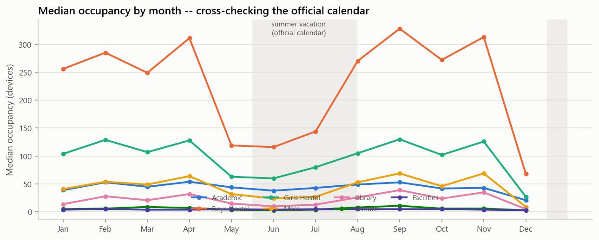

*The dip is centred on June and July exactly where the approximation puts it, and it is much deeper in the two dormitories than in the Academic building.*

**Dead-meter detection.**

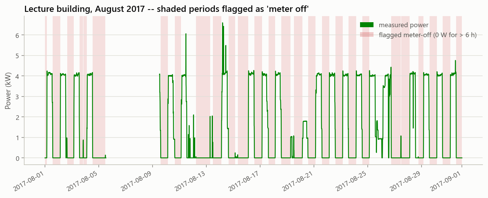

*Everything shaded is excluded from the energy accounting rather than counted as zero consumption.*

**A limitation of this rule, stated openly.** In the month shown the meter
alternates between about 4 kW by day and exactly zero every night -- which looks
less like a broken meter than like a building switched off at the mains. Both
report exactly 0 W, and no rule based on the power value alone can separate them.
Checking the length of every zero run shows two distinct populations:

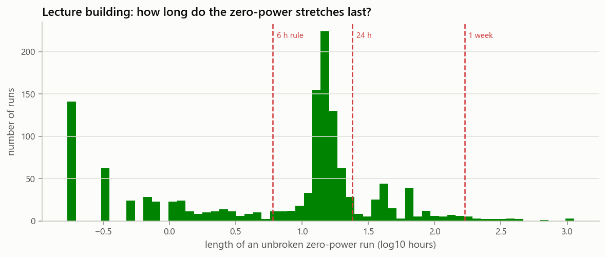

*Two populations: many short runs near half a day (the nightly switch-off, 34.5% of all zero hours) and a few very long runs that account for 65.5% of them.*

| hours | runs | total hours | share of zero hours % |
|---|---|---|---|
| < 6 h | 418 | 408 | 1.30 |
| 6-18 h | 574 | 7,997 | 26.10 |
| 18-24 h | 106 | 2,152 | 7 |
| 1-2 days | 95 | 3,642 | 11.90 |
| 2-7 days | 88 | 7,504 | 24.50 |
| over a week | 22 | 8,928 | 29.10 |

The overwhelming majority of the Lecture meter's dead time sits in runs lasting
days to months, where the rule is clearly right. The overnight runs are where it
may be wrong. We keep the specified 6-hour rule as primary and quantify the
ambiguity with a 24-hour sensitivity check in Phase 5 (decision D01-07).

**Outlier flagging.**

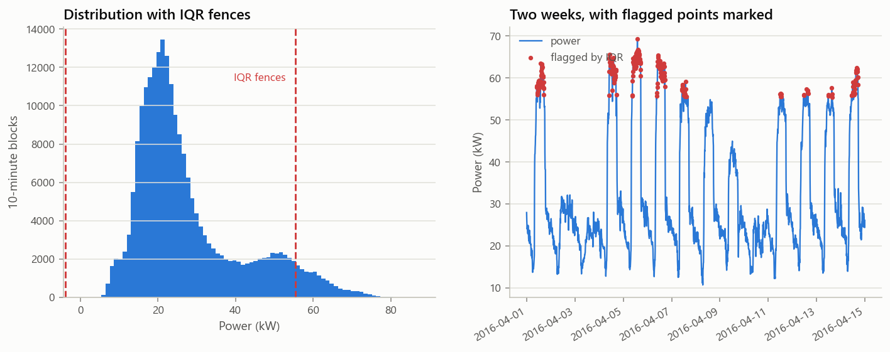

*The flagged points are mostly ordinary working-day peaks. An automatic 'remove outliers' step would have deleted every busy afternoon -- which is why this project flags instead of deletes.*

**Transformation and scaling.**

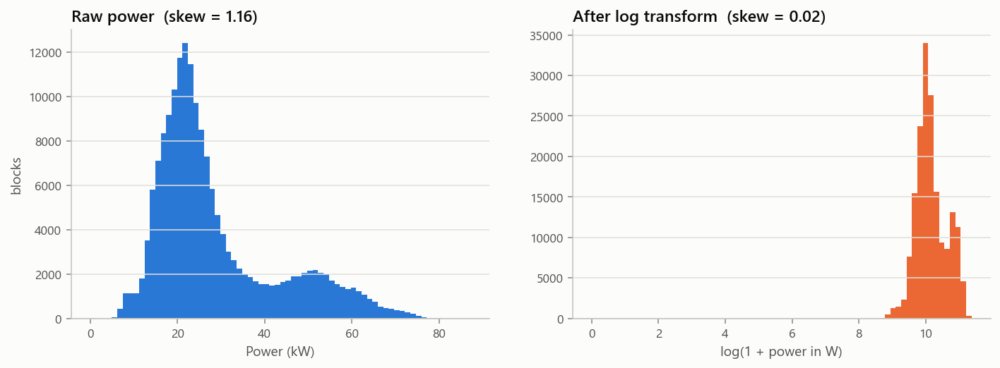

*The log transform cuts skew from 1.16 to 0.02, but the distribution stays bimodal -- a night cluster and a day cluster -- because that is a real physical feature, not a distortion.*

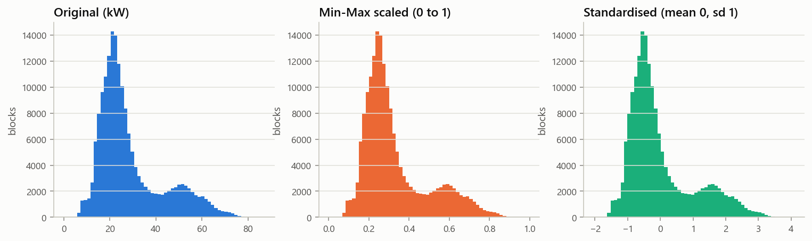

*Scaling moves and stretches an axis; it does not change the shape of the distribution. What changes is which features dominate a distance or a regression coefficient.*
<!-- END:results_phase1 -->

### 6.3 Phase 2 — Statistics and EDA

<!-- BEGIN:results_phase2 -->
### Descriptive statistics

| building | n | mean | median | mode (1 kW bins) | min | max | range | variance | std | Q1 | Q3 | IQR | skew |
|---|---|---|---|---|---|---|---|---|---|---|---|---|---|
| Academic | 176,730 | 28,843.90 | 23,980 | 22,000 | 0 | 87,120.60 | 87,120.60 | 201,289,521 | 14,187.70 | 19,226.70 | 34,389.50 | 15,162.80 | 1.16 |
| Boys_Hostel | 119,024 | 32,818.30 | 30,793.40 | 24,000 | 7,043.30 | 87,537.40 | 80,494.10 | 155,657,815.10 | 12,476.30 | 23,327.70 | 39,994.40 | 16,666.70 | 0.80 |
| Girls_Hostel | 117,186 | 15,003.70 | 14,849.10 | 15,000 | 4,551 | 30,282.90 | 25,731.90 | 18,659,460.70 | 4,319.70 | 11,874.90 | 17,758.70 | 5,883.80 | 0.28 |
| Mess | 157,266 | 23,523 | 22,100.10 | 18,000 | 233.40 | 133,731.30 | 133,497.80 | 77,680,420.70 | 8,813.60 | 16,869.20 | 28,874.60 | 12,005.40 | 0.80 |
| Library | 118,720 | 10,161.40 | 7,688.90 | 5,000 | 768.30 | 46,145.80 | 45,377.50 | 50,335,404.50 | 7,094.70 | 4,999.80 | 13,654 | 8,654.20 | 1.23 |
| Lecture | 36,930 | 3,019 | 3,902 | 4,000 | 0 | 26,491 | 26,491 | 3,312,273.10 | 1,820 | 1,490.10 | 4,313.70 | 2,823.60 | 1.69 |
| Facilities | 149,353 | 11,299.70 | 10,791.80 | 9,000 | 547.20 | 138,916.10 | 138,368.90 | 23,527,220 | 4,850.50 | 8,797.20 | 13,110.60 | 4,313.30 | 10.59 |

The mean exceeds the median in every building, so every distribution is
right-skewed. The Boys hostel has the highest average power
(32.8 kW),
above the Academic building, because it is occupied around the clock. Facilities
is the extreme case with a skew of
10.6 -- its maximum
is more than ten times its median, pointing to a large intermittent load.

### Manual calculation checked against pandas

Every statistic above was recomputed from its definition with NumPy and asserted
equal to the pandas result. The largest relative difference across all eleven
statistics was
4.5e-15
-- floating-point noise. The check runs as an assertion, so the notebook fails if
they ever diverge.

### Population versus sample

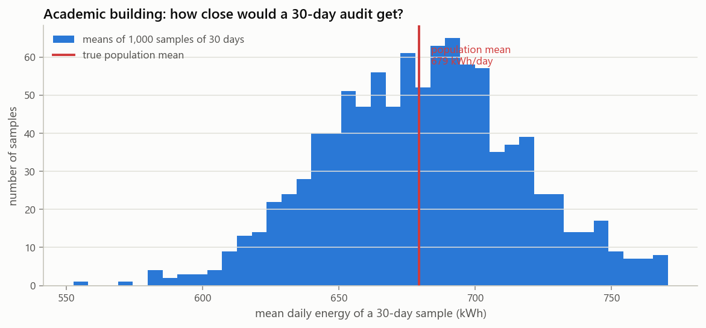

*The sample means form the bell shape the central limit theorem predicts, centred on the population mean; the observed standard error (36 kWh) matches the predicted one (37 kWh).*

65.0% of 30-day samples land within 5% of the true mean -- **but only
because the days are drawn at random across the whole year**. An audit that
happened to run in June would measure the air-conditioning season instead. This
is why the project uses the full 3.7-year record rather than a sample.

### What distribution does power follow?

| distribution | KS statistic (lower is better) | KS p-value |
|---|---|---|
| Normal | 0.17 | < 1e-300 |
| Log-normal | 0.08 | 1.03e-300 |

The log-normal fits better on the KS statistic, as expected for a strictly
positive right-skewed quantity. But the Q-Q plots show **neither is a good fit**:
the Academic building's power is genuinely bimodal -- a night cluster and a day
cluster -- and no unimodal distribution can describe two clusters.

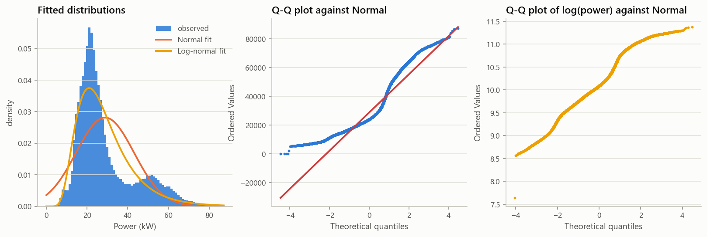

*Both candidate distributions bend away from the line at the extremes; the data is bimodal, which is a physical feature rather than a distortion.*

This shapes Phase 4: because power is not normally distributed, MAE is reported
alongside RMSE, since RMSE is dominated by the tail.

### Hypothesis tests

**Semester versus vacation:**

| building | n semester | n vacation | mean semester (W) | mean vacation (W) | difference in means | percent difference | cohens d | effect size label | t-test p | Mann-Whitney p |
|---|---|---|---|---|---|---|---|---|---|---|
| Academic | 129,756 | 46,974 | 28,538.30 | 29,688 | -1,149.70 | -3.90 | -0.08 | negligible | 4.15e-55 | 1.38e-140 |
| Boys_Hostel | 94,438 | 24,586 | 34,970.30 | 24,552.40 | 10,417.90 | 42.40 | 0.89 | large | < 1e-300 | < 1e-300 |
| Girls_Hostel | 94,691 | 22,495 | 15,209.30 | 14,138.10 | 1,071.30 | 7.60 | 0.25 | small | 3.19e-297 | 5.08e-193 |
| Mess | 122,966 | 34,300 | 23,698.20 | 22,894.80 | 803.40 | 3.50 | 0.09 | negligible | 4.00e-46 | 3.41e-105 |
| Library | 92,804 | 25,916 | 10,519.40 | 8,879.40 | 1,640 | 18.50 | 0.23 | small | 4.21e-272 | < 1e-300 |
| Lecture | 26,923 | 10,007 | 3,553.10 | 1,582 | 1,971.10 | 124.60 | 1.24 | large | < 1e-300 | < 1e-300 |
| Facilities | 109,432 | 39,921 | 10,724.10 | 12,877.60 | -2,153.50 | -16.70 | -0.45 | small | < 1e-300 | < 1e-300 |

**Weekday versus weekend:**

| building | mean weekday (W) | mean weekend (W) | difference in means | percent difference | cohens d | effect size label | t-test p | Mann-Whitney p |
|---|---|---|---|---|---|---|---|---|
| Academic | 31,624.20 | 21,791.20 | 9,833 | 45.10 | 0.73 | medium | < 1e-300 | < 1e-300 |
| Boys_Hostel | 33,475 | 31,136.80 | 2,338.30 | 7.50 | 0.19 | negligible | 1.03e-207 | 3.77e-139 |
| Girls_Hostel | 15,243.20 | 14,390.20 | 853 | 5.90 | 0.20 | negligible | 1.97e-219 | 1.65e-184 |
| Mess | 24,259.30 | 21,668 | 2,591.20 | 12 | 0.30 | small | < 1e-300 | < 1e-300 |
| Library | 11,408 | 6,934.90 | 4,473.10 | 64.50 | 0.66 | medium | < 1e-300 | < 1e-300 |
| Lecture | 3,146.50 | 2,271.60 | 874.90 | 38.50 | 0.49 | small | 2.70e-123 | < 1e-300 |
| Facilities | 11,581.70 | 10,582.70 | 999 | 9.40 | 0.21 | small | 3.48e-217 | < 1e-300 |

Every p-value here is small enough to print in scientific notation, so on a naive
"p < 0.05" reading every difference is significant and the p-values tell us
nothing beyond the fact that we have a lot of data. The **Cohen's d** column
carries the finding, and it is **not uniform across the campus**.

*Semester versus vacation* splits the buildings in two. The
**Boys Hostel** (d = 0.89) and **Lecture** (d = 1.24) show large effects -- buildings whose purpose empties out when term
ends. But the **Academic** (d = -0.08) and **Mess** (d = 0.09) barely move, and **Facilities** (d = -0.45) actually consumes **more** power
during vacation, because the Indian summer vacation coincides with Delhi's
hottest months: cooling load rises exactly as occupation falls. That is the
no-weather-data limitation made visible.

*Weekday versus weekend* splits them the other way. The
**Academic** (d = 0.73) and **Library** (d = 0.66) fall substantially at weekends, while both hostels are essentially
flat (d = 0.19
and 0.20) --
which is correct, because people live there on Saturdays too.

The contrast is what matters for Phase 5. Buildings *can* respond strongly to
whether people are present -- the Library drops
64% at
weekends, so it is clearly possible. Buildings that do not respond are therefore
making a choice, not obeying a physical necessity.

### The chart set

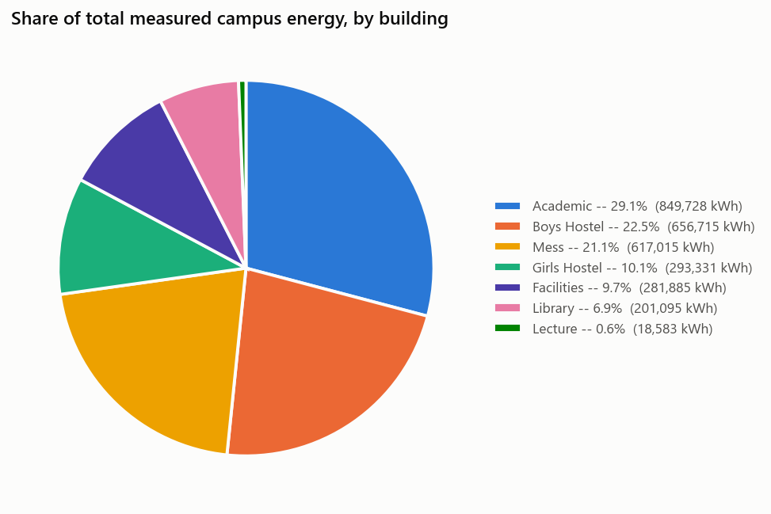

*Shares reflect *measured* energy, and the buildings have very different amounts of usable data (Lecture only 19%), so this shows what was recorded rather than what the campus consumed.*

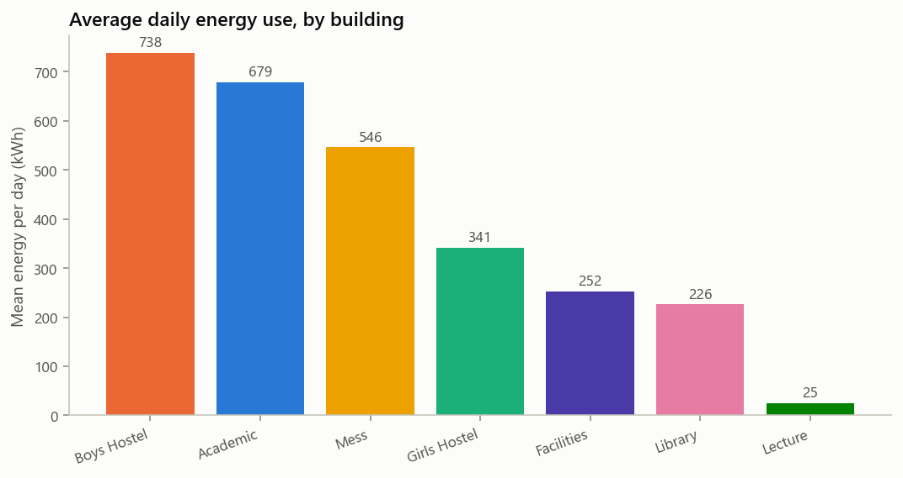

*The fair comparison, independent of how many days each meter recorded. The Boys hostel is the largest daily consumer at 731 kWh/day.*

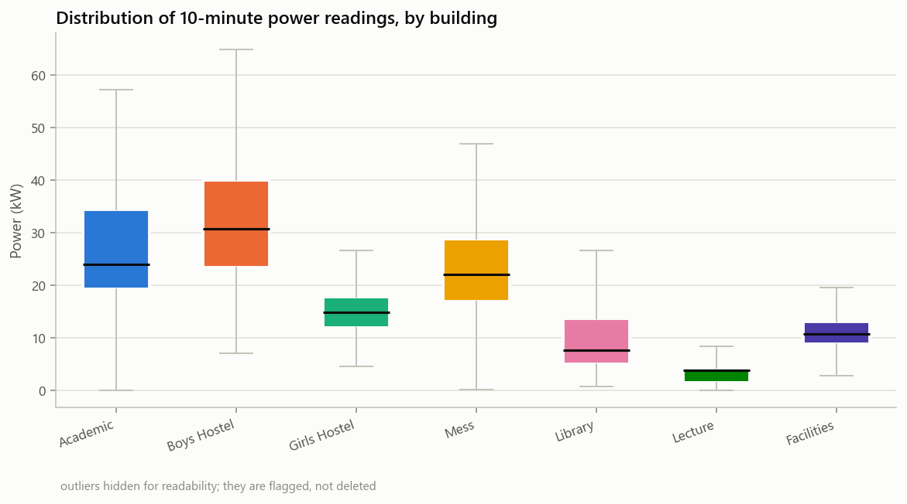

*The hostels have narrow boxes -- steady load from continuous occupation. Academic and Library have tall boxes: they swing between a quiet night baseline and a busy day.*

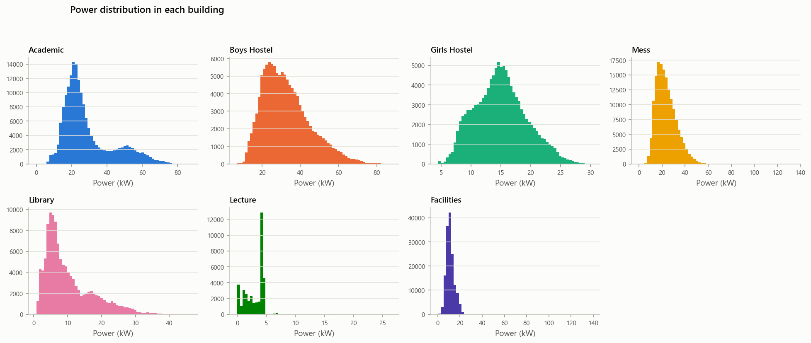

*Academic and Library are visibly bimodal (a night hump and a day hump); the hostels are closer to one broad peak because they never really switch off.*

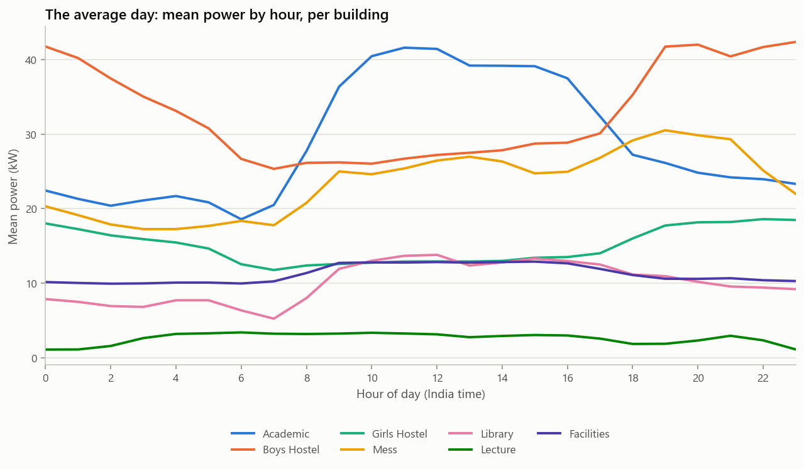

*The most important chart in this phase: the commercial buildings fall at night but do not fall to zero -- the Academic building still draws around 20 kW at 3 a.m. That gap is what Phase 5 quantifies.*

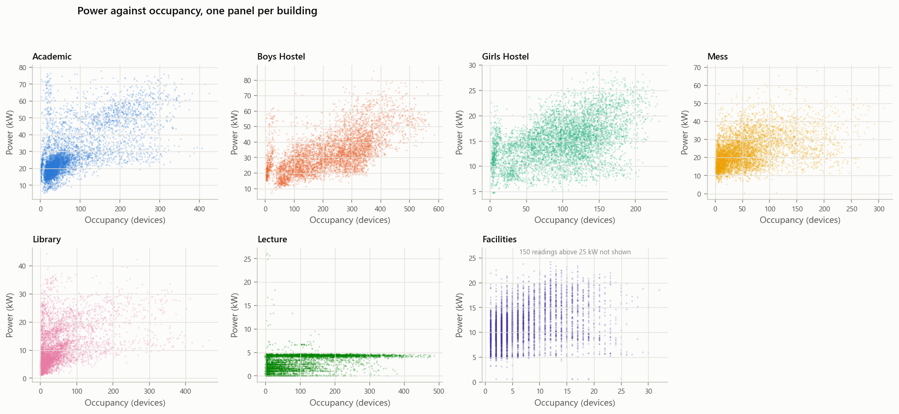

*Every cloud slopes upward, and every cloud has a floor well above zero on the left: even at minimum occupancy the building draws a substantial load.*

### Power-occupancy correlation

| building | kind | n | pearson r | pearson p | spearman r | spearman p | r squared |
|---|---|---|---|---|---|---|---|
| Academic | commercial | 176,730 | 0.67 | < 1e-300 | 0.65 | < 1e-300 | 0.45 |
| Boys_Hostel | residential | 119,024 | 0.65 | < 1e-300 | 0.66 | < 1e-300 | 0.42 |
| Girls_Hostel | residential | 117,186 | 0.45 | < 1e-300 | 0.43 | < 1e-300 | 0.20 |
| Mess | commercial | 157,266 | 0.41 | < 1e-300 | 0.45 | < 1e-300 | 0.17 |
| Library | commercial | 118,720 | 0.50 | < 1e-300 | 0.61 | < 1e-300 | 0.25 |
| Lecture | commercial | 36,930 | 0.31 | < 1e-300 | 0.36 | < 1e-300 | 0.10 |
| Facilities | commercial | 149,353 | 0.27 | < 1e-300 | 0.37 | < 1e-300 | 0.07 |

Occupancy and power are correlated in every building but never strongly. The best
case is **Academic at r = 0.67**,
meaning occupancy explains about 44% of the
variation in its power; the weakest is
**Facilities at r = 0.27**
(8%). So **most of what determines a building's
power draw is not how many people are in it** -- a result in its own right, and
the quantitative form of the base-load floor visible in the scatter plots.

Spearman exceeds Pearson for the Library (0.61 against 0.50), indicating a real
but *bent* relationship: power rises with occupancy and then flattens.

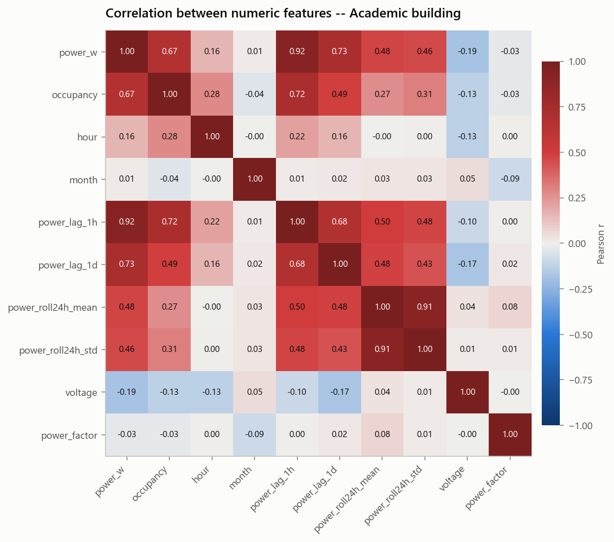

*The strongest predictor of power is power one hour ago (r about 0.95) -- buildings are inertial. Occupancy sits well behind the lag features, which is why Phase 4's interpretable models use calendar and occupancy features rather than lags.*

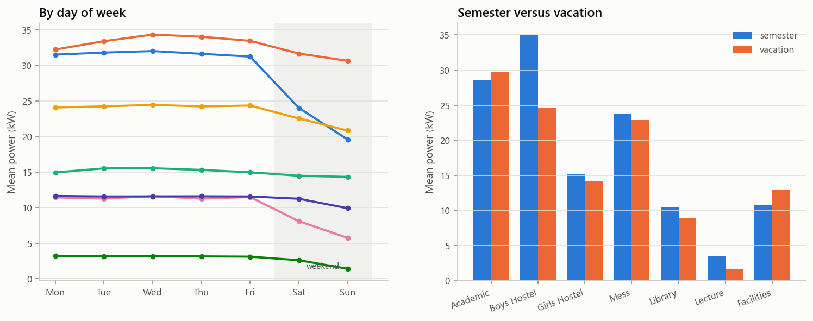

*The weekend drop is a few percent, not a collapse. In several buildings vacation power is as high as or higher than semester power, because Delhi's summer vacation coincides with the hottest months and the cooling runs regardless.*
<!-- END:results_phase2 -->

### 6.4 Phase 3 — PCA

<!-- BEGIN:results_phase3 -->
### How many shapes does a day have?

| component | variance explained % | cumulative % |
|---|---|---|
| PC1 | 55 | 55 |
| PC2 | 21 | 75.90 |
| PC3 | 10.90 | 86.90 |
| PC4 | 4.30 | 91.20 |
| PC5 | 3 | 94.10 |
| PC6 | 1.30 | 95.40 |

The first component alone accounts for **55.0%** of the variation
between days, and the first three for **86.9%**. An
Academic-building day is therefore well described by three numbers instead of 24.

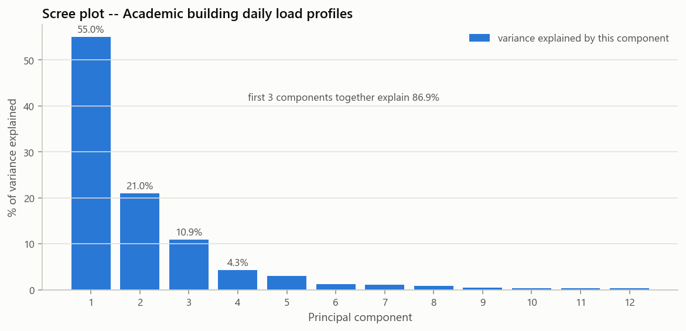

*PC1 explains 55.0% and the first three together 86.9% -- a real reduction in dimensionality, not a cosmetic one.*

### What the components mean

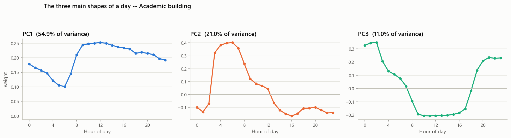

*PC1 has weights all of one sign -- it is the overall level of the day. PC2 changes sign across the clock -- it contrasts daytime against night. PC3 shifts the timing of the peak.*

**PC1 is 'how much'** -- its weights all share a sign, so a day scoring high is
above average at every hour. **PC2 is 'day versus night'** -- its weights change
sign, contrasting working hours with the night, so a high score means a peaky
day. **PC3 is the timing of the peak.** This is the usual pattern in building
energy data, which is itself a check that the matrix and the arithmetic are
behaving.

### Do days separate by calendar without being told the calendar?

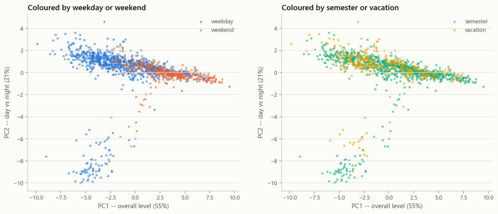

*Weekends separate clearly along PC2 -- flatter days with less contrast between working hours and night. PCA was never given the day of the week.*

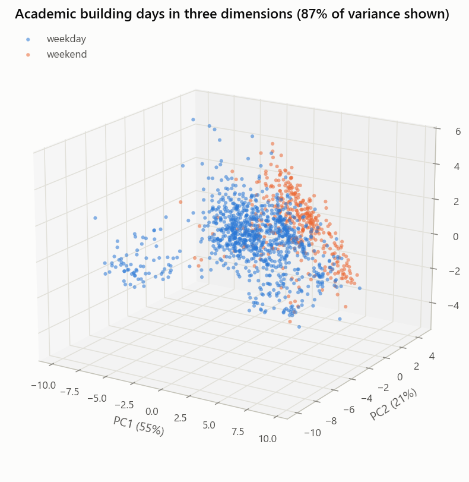

*Adding PC3 brings the displayed variance to 87%.*

Yes -- and the two calendar facts separate along *different* components. Weekends
sit lower on **PC2**: nobody arrives in the morning, so the daytime rise never
happens and the day is flat. Semester and vacation separate along **PC1**
instead, and less cleanly, because vacation days are not uniformly quieter --
some are among the highest-consuming days in the record, which is the summer
cooling load again.

### Day types

| cluster | name | days | mean power (kW) | night floor (kW) | midday (kW) | % weekend | % vacation |
|---|---|---|---|---|---|---|---|
| 0 | high load, daytime peak | 450 | 35.40 | 22.10 | 54.10 | 4.40 | 36.70 |
| 1 | lowest load, flat all day | 284 | 18.10 | 17.30 | 19.90 | 63.40 | 19 |
| 2 | highest load, morning peak | 80 | 41.20 | 36.20 | 59 | 7.50 | 18.80 |
| 3 | low load, morning peak | 488 | 26.10 | 20.10 | 35.50 | 33.40 | 22.10 |

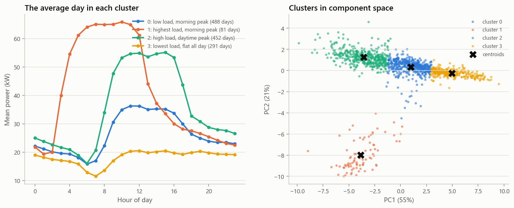

*The clusters correspond to recognisable kinds of day rather than arbitrary groupings -- their weekend and vacation shares differ sharply even though k-means never saw the calendar.*

### Which days are unusual?

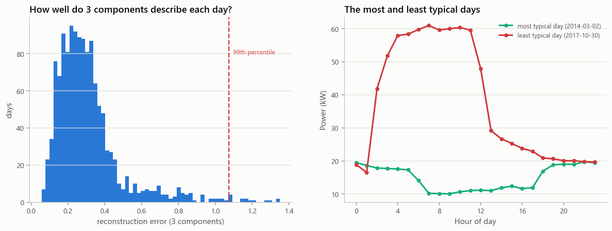

*A day the three main components cannot reproduce is an unusual day. This whole-day score cross-checks the interval-level detector built in Phase 6.*

### The same analysis on a dormitory

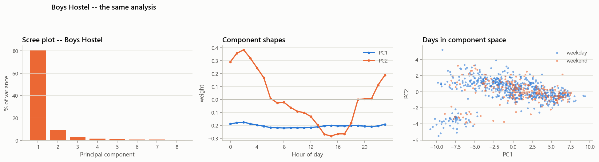

*The first three components explain 93.0% here, and the component shapes differ from the Academic building's -- the structure is a property of each building, not a universal.*

### Every building's daily shape, side by side

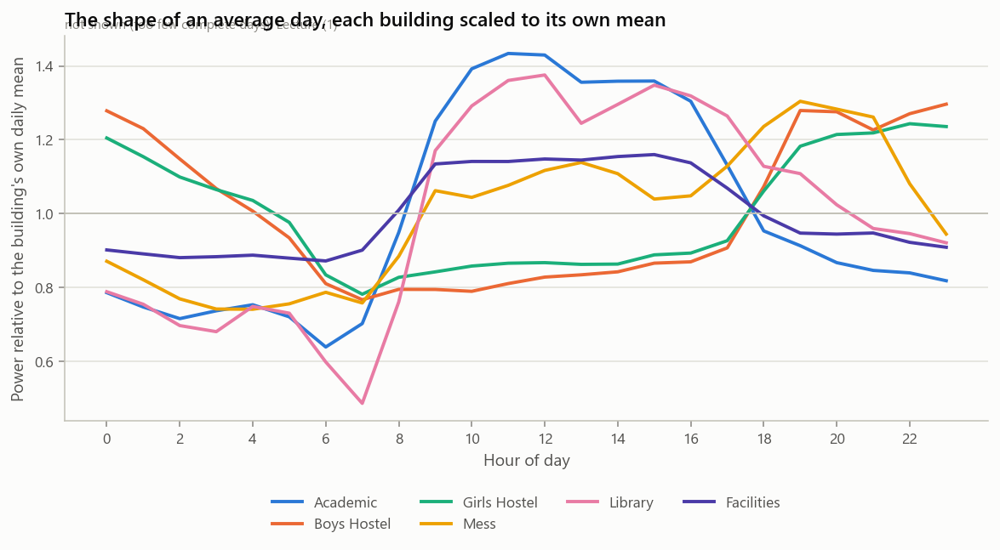

*Scaling out size leaves only shape. Academic and Library rise in the morning; the hostels do the opposite, lowest at midday and highest in the evening; the Mess shows meal-time peaks; Facilities is nearly a flat line.*

Buildings needing fewer than 30 complete days are absent, and their absence is a
result rather than an omission: drawing an average daily shape requires days that
run midnight to midnight with a live meter throughout.

| building | complete days available |
|---|---|
| Academic | 1,302 |
| Facilities | 1,119 |
| Mess | 1,105 |
| Library | 915 |
| Boys_Hostel | 828 |
| Girls_Hostel | 808 |
| Lecture | 1 |

**The Facilities line is the most important thing in this chart.** A building
whose daily profile is flat is consuming almost independently of the time of day
-- and therefore almost independently of whether anyone is inside. That is the
Phase 5 result appearing in advance, in a completely different kind of analysis.
<!-- END:results_phase3 -->

### 6.5 Phase 4 — Regression

<!-- BEGIN:results_phase4 -->
### The campus grew by a third to a half

Before any model result can be read, one thing has to be established:

| building | mean kW 2014 | mean kW 2015 | mean kW 2016 | mean kW 2017 | growth 2014-2017 % | r(power,occ) 2014 | r(power,occ) 2017 |
|---|---|---|---|---|---|---|---|
| Academic | 23.90 | 27.70 | 29.80 | 34 | 42.40 | 0.71 | 0.45 |
| Boys_Hostel | 27.20 | 32.30 | 32.90 | 40.10 | 47.30 | 0.62 | 0.62 |
| Girls_Hostel | 12.90 | 14.10 | 15.70 | 16.90 | 31.60 | 0.41 | 0.50 |
| Mess | 19.70 | 21.80 | 25.50 | 26.80 | 35.70 | 0.36 | 0.47 |
| Library | 7.50 | 11 | 10.60 | 10.20 | 36.80 | 0.54 | 0.39 |
| Lecture | 3.40 | 2.40 | 3.20 | 3.10 | -6.70 | 0.38 | 0.13 |
| Facilities | 8.80 | 10.30 | 11.80 | 13.10 | 48.40 | 0.04 | 0.41 |

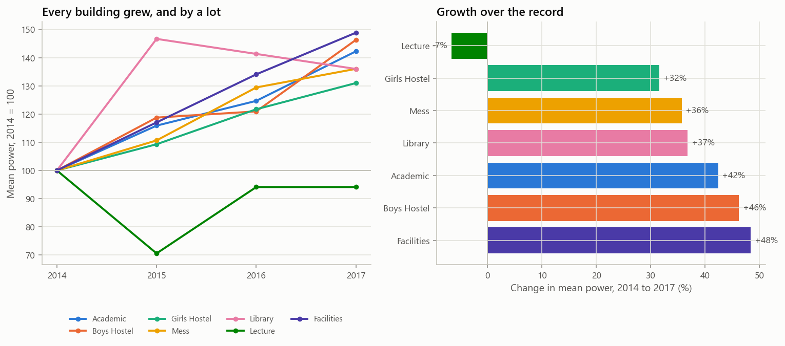

*Six of seven buildings grew between 32% and 48% in mean power over four years. The campus did not get more efficient; it got substantially more energy-hungry.*

This is a finding in its own right and it is also a methodological problem. The
test split is the last 15% of the record -- 2017, the highest-consuming period --
so a model fitted on 2014-2016 under-predicts it systematically. Note too that in
the Academic building the **power-occupancy correlation itself fell**, from
0.71 in 2014 to
0.45 in 2017: the
relationship the models depend on weakened over time. Test-set numbers below
should be read with that in mind, which is why model selection uses the
validation split.

### Model scores

| building | model | train R2 | val R2 | test R2 | test R2 (drift-corrected) | val MAE kW | test MAE kW | test RMSE kW |
|---|---|---|---|---|---|---|---|---|
| Academic | A: power ~ occupancy | 0.56 | - | -0.17 | - | - | 11.66 | 18.07 |
| Academic | B: time only | 0.61 | 0.47 | 0.06 | 0.15 | 7.74 | 11.16 | 16.15 |
| Academic | C: time + occupancy | 0.73 | 0.51 | 0.00 | 0.06 | 7.81 | 10.77 | 16.67 |
| Academic | D: random forest (time + occupancy) | 0.84 | 0.58 | -0.01 | 0.09 | 6.54 | 10.45 | 16.79 |
| Boys_Hostel | A: power ~ occupancy | 0.42 | - | 0.10 | - | - | 8.67 | 12.11 |
| Boys_Hostel | B: time only | 0.66 | 0.24 | -0.05 | 0.25 | 9.06 | 10.07 | 13.12 |
| Boys_Hostel | C: time + occupancy | 0.79 | 0.37 | 0.07 | 0.25 | 8.68 | 9.33 | 12.31 |
| Boys_Hostel | D: random forest (time + occupancy) | 0.75 | 0.50 | 0.13 | 0.22 | 7.17 | 8.70 | 11.91 |
| Girls_Hostel | A: power ~ occupancy | 0.21 | - | -0.88 | - | - | 3.62 | 4.52 |
| Girls_Hostel | B: time only | 0.66 | -0.61 | -0.97 | -0.66 | 3.45 | 3.76 | 4.63 |
| Girls_Hostel | C: time + occupancy | 0.72 | -0.17 | -0.94 | -0.59 | 2.87 | 3.76 | 4.59 |
| Girls_Hostel | D: random forest (time + occupancy) | 0.69 | -0.32 | -0.79 | -0.52 | 3.06 | 3.54 | 4.41 |
| Mess | A: power ~ occupancy | 0.15 | - | -0.08 | - | - | 7.53 | 10.07 |
| Mess | B: time only | 0.42 | 0.34 | -0.08 | 0.04 | 4.57 | 7.78 | 10.06 |
| Mess | C: time + occupancy | 0.44 | 0.33 | -0.05 | 0.07 | 4.59 | 7.69 | 9.92 |
| Mess | D: random forest (time + occupancy) | 0.54 | 0.23 | -0.06 | -0.01 | 4.83 | 7.67 | 9.96 |
| Library | A: power ~ occupancy | 0.30 | - | -0.05 | - | - | 6.82 | 8.53 |
| Library | B: time only | 0.34 | -0.28 | 0.00 | -0.07 | 4.53 | 6.77 | 8.32 |
| Library | C: time + occupancy | 0.45 | -0.08 | -0.11 | -0.14 | 4.05 | 7.06 | 8.78 |
| Library | D: random forest (time + occupancy) | 0.62 | 0.20 | -0.07 | -0.07 | 3.08 | 6.54 | 8.64 |
| Lecture | A: power ~ occupancy | 0.17 | - | -0.30 | - | - | 1.36 | 1.58 |
| Lecture | B: time only | 0.45 | -0.17 | 0.29 | 0.02 | 1.28 | 0.83 | 1.16 |
| Lecture | C: time + occupancy | 0.46 | -0.17 | 0.27 | -0.00 | 1.29 | 0.87 | 1.19 |
| Lecture | D: random forest (time + occupancy) | 0.68 | -0.04 | 0.29 | 0.07 | 1.24 | 0.83 | 1.17 |
| Facilities | A: power ~ occupancy | 0.06 | - | -0.67 | - | - | 2.98 | 3.94 |
| Facilities | B: time only | 0.27 | 0.27 | 0.03 | 0.19 | 1.95 | 2.25 | 3.01 |
| Facilities | C: time + occupancy | 0.28 | 0.21 | 0.05 | 0.14 | 2.07 | 2.21 | 2.98 |
| Facilities | D: random forest (time + occupancy) | 0.46 | 0.29 | -0.05 | 0.03 | 1.94 | 2.28 | 3.13 |

### Does occupancy help? (Research question 2)

| building | B val R2 | C val R2 | R2 gain from occupancy | B val MAE kW | C val MAE kW | MAE improvement % | D (forest) val R2 |
|---|---|---|---|---|---|---|---|
| Academic | 0.47 | 0.51 | 0.03 | 7.74 | 7.81 | -0.90 | 0.58 |
| Boys_Hostel | 0.24 | 0.37 | 0.13 | 9.06 | 8.68 | 4.20 | 0.50 |
| Girls_Hostel | -0.61 | -0.17 | 0.44 | 3.45 | 2.87 | 16.90 | -0.32 |
| Mess | 0.34 | 0.33 | -0.01 | 4.57 | 4.59 | -0.40 | 0.23 |
| Library | -0.28 | -0.08 | 0.20 | 4.53 | 4.05 | 10.70 | 0.20 |
| Lecture | -0.17 | -0.17 | 0.00 | 1.28 | 1.29 | -1.10 | -0.04 |
| Facilities | 0.27 | 0.21 | -0.06 | 1.95 | 2.07 | -6.10 | 0.29 |

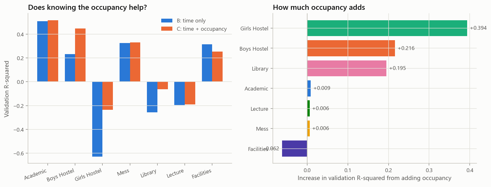

*Occupancy improves validation R-squared in 5 of the 7 buildings, by a mean of +0.107, but the gain ranges from -0.063 to +0.444.*

**Yes -- in most buildings, modestly, and very unevenly.** Adding occupancy
raises validation R-squared in **5 of 7** buildings, with a
mean gain of **+0.107**. But the spread is the real story: the largest
gain is Girls Hostel at
**+0.444**, while occupancy makes the model
slightly *worse* in Mess, Facilities
(-0.063 at worst). It improves MAE in
3 of 7.

**A note on how to read these numbers.** Several validation R-squared values are
negative, meaning the model does worse than simply predicting the validation
mean. That is the concept drift of section 6.5 again -- the validation period
sits at a different consumption level from the training period. The *difference*
between C and B is still meaningful, because both models are fitted on the same
training data and face exactly the same drift; whatever the drift costs, it costs
them equally.

This is consistent with the LBNL finding that occupancy data adds only modestly
to building baseline models, and it is a real answer to research question 2
rather than a disappointment: **most of what drives these buildings is not the
number of people in them.** The same conclusion arrives independently from the
Phase 2 correlations and the Phase 3 flat daily profiles.

The pattern across buildings is also readable. Occupancy helps most where people
genuinely drive the load -- the Girls hostel
(+0.444)
and the Library
(+0.205) --
and helps least, or slightly hurts, in the Mess and Facilities, whose loads are
driven by equipment schedules and weather rather than by headcount.

### Cross-validation with TimeSeriesSplit

| building | model | CV MAE kW (mean) | CV MAE kW (sd) | folds |
|---|---|---|---|---|
| Academic | B: time only | 6.87 | 0.86 | 5 |
| Academic | C: time + occupancy | 5.73 | 0.32 | 5 |
| Boys_Hostel | B: time only | 7.47 | 1.54 | 5 |
| Boys_Hostel | C: time + occupancy | 5.46 | 1 | 5 |
| Girls_Hostel | B: time only | 2.66 | 0.43 | 5 |
| Girls_Hostel | C: time + occupancy | 2.52 | 0.72 | 5 |
| Mess | B: time only | 5.69 | 1.61 | 5 |
| Mess | C: time + occupancy | 5.58 | 1.66 | 5 |
| Library | B: time only | 5.30 | 1.48 | 5 |
| Library | C: time + occupancy | 4.70 | 1.61 | 5 |
| Lecture | B: time only | 1.50 | 1.10 | 5 |
| Lecture | C: time + occupancy | 1.39 | 0.88 | 5 |
| Facilities | B: time only | 2.87 | 0.50 | 5 |
| Facilities | C: time + occupancy | 2.79 | 0.56 | 5 |

### Base load and responsiveness -- the numbers Phase 5 uses

| building | kind | a: base load (kW) | b: watts per occupant | mean power (kW) | base load as % of mean | night 02-06 median (kW) | R2 in sample |
|---|---|---|---|---|---|---|---|
| Academic | commercial | 16.95 | 128.10 | 27.21 | 62.30 | 18.96 | 0.56 |
| Boys_Hostel | residential | 15.94 | 68 | 30.88 | 51.60 | 32.76 | 0.42 |
| Girls_Hostel | residential | 10.60 | 36.30 | 14.12 | 75.10 | 14.81 | 0.21 |
| Mess | commercial | 18.85 | 61.70 | 22.67 | 83.20 | 16.12 | 0.15 |
| Library | commercial | 7.24 | 68.50 | 10.31 | 70.30 | 5.84 | 0.30 |
| Lecture | commercial | 2.13 | 7.40 | 2.95 | 72.50 | 1.07 | 0.17 |
| Facilities | commercial | 9.27 | 231.70 | 10.82 | 85.70 | 9.75 | 0.06 |

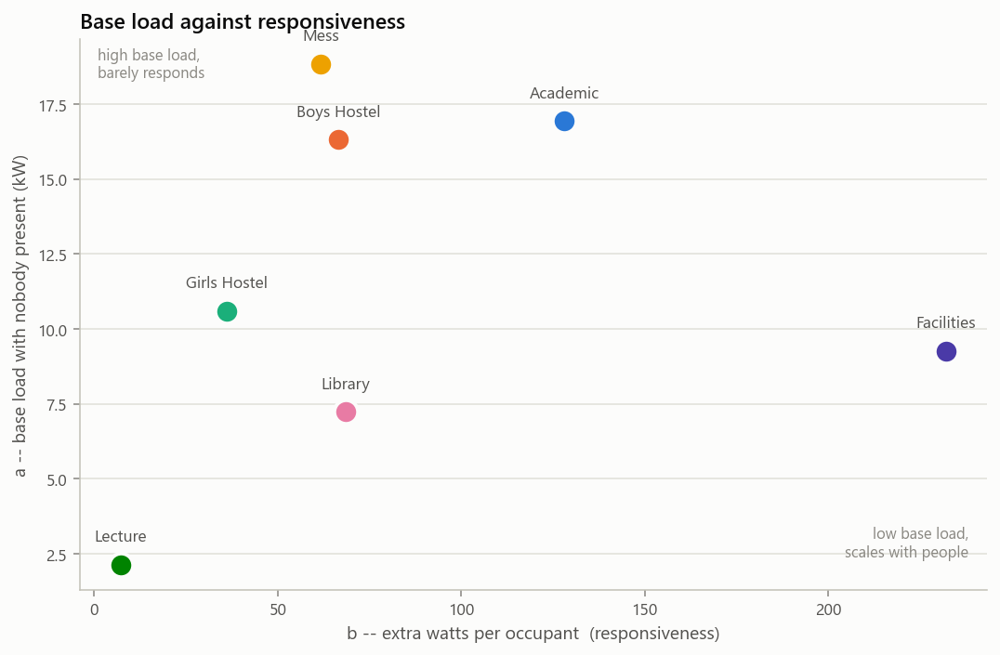

*Buildings towards the top-left run their equipment regardless of who is present; buildings towards the bottom-right scale with their occupants.*

The `a` column is the load the fitted line predicts at zero occupancy -- the
power a building draws with nobody in it -- and the night-time median column is
an independent check on it from a completely different calculation. Phase 5 takes
these two coefficients and turns them into the headline ranking.

### Predictions against reality

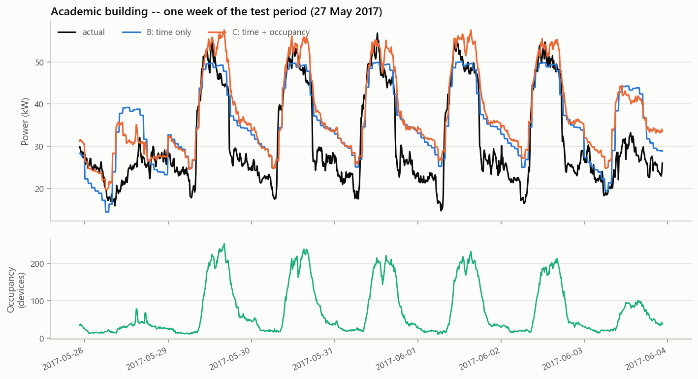

*Both models reproduce the daily rhythm; model C bends towards the actual line when occupancy is unusual for the time of day. Neither captures the sharp peaks -- and those leftover peaks are what Phase 6 detects.*

Note the chart uses two stacked panels rather than two y-axes. Watts and people
are different quantities, and putting them on one axis would invent a visual
relationship that does not exist.

### Overfitting

| max depth | train MAE w | val MAE w |
|---|---|---|
| 2 | 6,481.30 | 6,523.70 |
| 4 | 5,617.10 | 6,345.50 |
| 6 | 4,894.90 | 7,590 |
| 8 | 4,383.80 | 6,711.40 |
| 12 | 3,724.50 | 6,537.20 |
| 16 | 3,310.70 | 6,469.50 |
| 24 | 2,844.80 | 6,462.20 |
| unlimited | 2,711.30 | 6,467.50 |

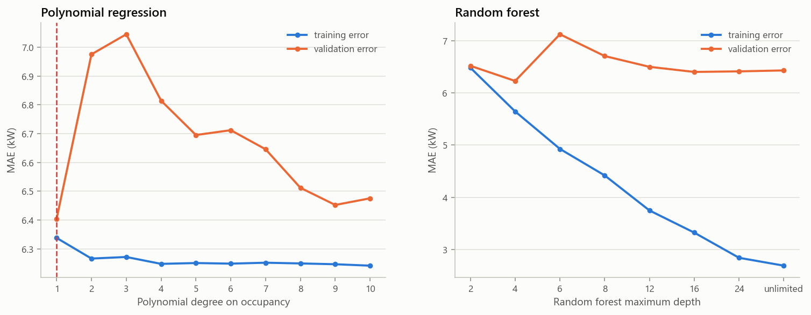

*The forest shows the textbook picture: at unlimited depth its training error is 2.71 kW but its validation error is 6.47 kW, a gap of 2.4x. That gap is overfitting made visible.*

### What the forest uses

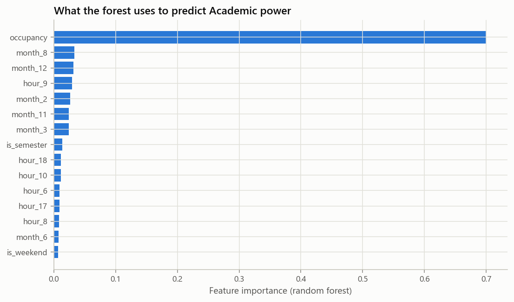

*Occupancy is the strongest single input, ahead of every hour-of-day indicator -- which is reassuring for a project built around it.*

### Residuals

| detector | mean residual kW | sd residual kW | median kW |
|---|---|---|---|
| T (model B, time only) | -0.30 | 15.35 | -5.22 |
| O (model C, time + occupancy) | -2.20 | 16.01 | -6.53 |

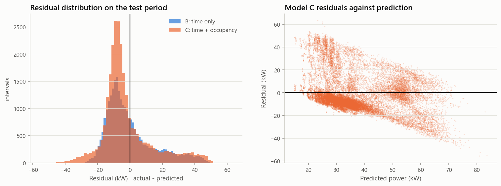

*After the drift correction both distributions sit near zero and model C's is narrower. Residuals fan out at high predicted power, so Phase 6 scores deviations relative to the spread of the residuals rather than in absolute watts.*
<!-- END:results_phase4 -->

### 6.6 Phase 5 — Wasted energy

<!-- BEGIN:results_phase5 -->
### Thresholds

| building | kind | p95 occupancy | threshold (5% of p95) | usable intervals | intervals at/below threshold | % of intervals | threshold reachable |
|---|---|---|---|---|---|---|---|
| Academic | commercial | 258 | 12.90 | 176,730 | 11,529 | 6.52 | True |
| Boys_Hostel | residential | 421 | 21.05 | 119,024 | 7,088 | 5.96 | True |
| Girls_Hostel | residential | 180 | 9 | 117,186 | 7,345 | 6.27 | True |
| Mess | commercial | 177 | 8.85 | 157,266 | 19,794 | 12.59 | True |
| Library | commercial | 182 | 9.10 | 118,720 | 33,670 | 28.36 | True |
| Lecture | commercial | 298 | 14.90 | 36,930 | 8,270 | 22.39 | True |
| Facilities | commercial | 18 | 0.90 | 149,353 | 0 | 0 | False |

Facilities is the exception predicted in Phase 0: its occupancy runs 1 to 47 with
a 95th percentile of 18, so the threshold is **0.9** -- below its own minimum
observed count -- and **no interval qualifies**. The rule is kept identical for
every building rather than bent for one; its behaviour is read off the
sensitivity curve instead.

### The headline table

| building | kind | threshold | coverage % | total kWh measured | low-occupancy kWh | low-occupancy energy share % | % of intervals low | mean power overall (kW) | mean power when low (kW) | intensity ratio | base load a (kW) | watts per occupant b |
|---|---|---|---|---|---|---|---|---|---|---|---|---|
| Academic | commercial | 12.90 | 90.40 | 849,596.90 | 40,832.10 | 4.81 | 6.52 | 28.84 | 21.25 | 0.74 | 16.95 | 128.10 |
| Boys_Hostel | residential | 21.05 | 60.90 | 651,028.10 | 28,959.20 | 4.45 | 5.96 | 32.82 | 24.51 | 0.75 | 15.94 | 68 |
| Girls_Hostel | residential | 9 | 60 | 293,037.10 | 14,587.80 | 4.98 | 6.27 | 15 | 11.92 | 0.79 | 10.60 | 36.30 |
| Mess | commercial | 8.85 | 80.50 | 616,561.30 | 57,580.60 | 9.34 | 12.59 | 23.52 | 17.45 | 0.74 | 18.85 | 61.70 |
| Library | commercial | 9.10 | 60.80 | 201,059.60 | 35,043.50 | 17.43 | 28.36 | 10.16 | 6.24 | 0.61 | 7.24 | 68.50 |
| Lecture | commercial | 14.90 | 18.90 | 18,581.90 | 3,541.80 | 19.06 | 22.39 | 3.02 | 2.57 | 0.85 | 2.13 | 7.40 |
| Facilities | commercial | 0.90 | 85.50 | 281,274.10 | 0 | 0 | 0 | 11.30 | - | - | 9.27 | 231.70 |

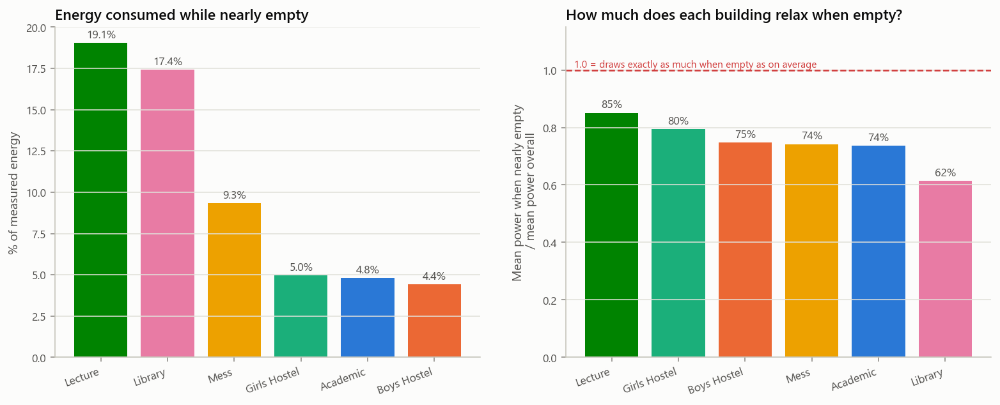

*The right-hand panel is the one to read: when nearly empty, these buildings still draw between 62% and 85% of their average power.*

### Sensitivity to the threshold

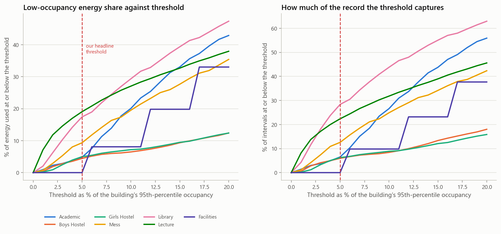

*Six of seven curves rise smoothly and the ranking of buildings barely changes across the range, so the finding does not depend on the exact threshold. Facilities is a staircase because its occupancy is a small integer.*

Six of the seven curves rise smoothly with no jumps, and the ranking of buildings
is stable across the whole range, so the headline does not rest on the choice of
5%. **Facilities is the exception, and the shape of its curve is diagnostic**: it
is a staircase, jumping at roughly 6%, 12% and 17% and flat in between. Occupancy
there is a small integer running from 1 to 47, so a sliding threshold only ever
crosses whole numbers, and between crossings nothing changes. That is the same
fact that made the standard threshold unreachable for this building, seen from
another angle -- a relative threshold assumes occupancy is effectively
continuous, and in a building this small it is not.

### Comparison with the published literature

| building | kind | out-of-hours share % (clock rule) | % intervals out of hours | low-occupancy share % (occupancy rule) | % intervals low occupancy |
|---|---|---|---|---|---|
| Academic | commercial | 55.25 | 69.98 | 4.81 | 6.52 |
| Boys_Hostel | residential | 74.10 | 69.65 | 4.45 | 5.96 |
| Girls_Hostel | residential | 73.66 | 70.11 | 4.98 | 6.27 |
| Mess | commercial | 66.37 | 69.98 | 9.34 | 12.59 |
| Library | commercial | 54.96 | 68.82 | 17.43 | 28.36 |
| Lecture | commercial | 22.09 | 27.62 | 19.06 | 22.39 |
| Facilities | commercial | 63.65 | 68.64 | 0 | 0 |

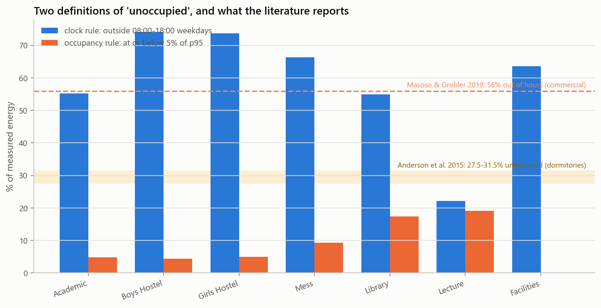

*Applying Masoso & Grobler's own clock-based definition to this data gives the Academic building 55.2% and the Library 55.0%, against their published 56%.*

**This is the strongest external check in the project.** Applying Masoso &
Grobler's clock-based definition to our data gives the Academic building
**55.2%** and the Library **55.0%** -- against their published
**56%**, from different buildings on a different continent fifteen years earlier.
Landing within a percentage point is good evidence that the pipeline measures
what it claims to.

It also shows that the two definitions are **not measuring the same thing**. A
clock rule calls 3 p.m. on a vacation Tuesday "occupied" when the building is
empty, and 8 p.m. during exams "unoccupied" when the Library is full. The
occupancy rule uses what was actually measured but is far stricter, because WiFi
over-counting means genuinely quiet periods still register double-digit device
counts. The truth lies between them, and **our occupancy-based figure is a
conservative lower bound** -- a conclusion the corrected-occupancy check below
independently confirms.

### Base load: two independent routes to the same number

| building | base load a from model A (kW) | night 02:00-06:00 median (kW) | difference (kW) | difference % | mean power (kW) | base load as % of mean |
|---|---|---|---|---|---|---|
| Academic | 16.95 | 19.74 | -2.79 | -14.10 | 28.84 | 58.80 |
| Boys_Hostel | 15.94 | 33.51 | -17.57 | -52.40 | 32.82 | 48.60 |
| Girls_Hostel | 10.60 | 15.43 | -4.83 | -31.30 | 15 | 70.60 |
| Mess | 18.85 | 16.76 | 2.09 | 12.40 | 23.52 | 80.10 |
| Library | 7.24 | 5.69 | 1.55 | 27.30 | 10.16 | 71.30 |
| Lecture | 2.13 | 3.97 | -1.84 | -46.30 | 3.02 | 70.60 |
| Facilities | 9.27 | 10.17 | -0.90 | -8.80 | 11.30 | 82 |

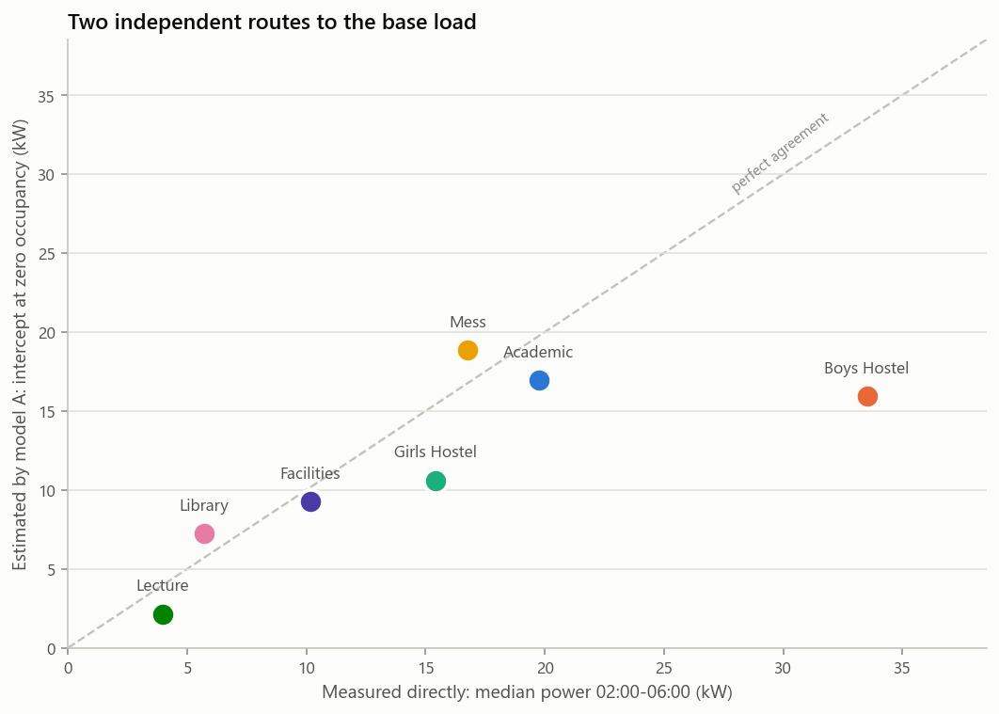

*A regression intercept and a raw night-time median are computed in completely different ways; that they track each other is real corroboration that the base load is not an artefact of the fit.*

Where the two disagree, the direction is informative. The Boys hostel's night
median sits far *above* its model intercept -- exactly right for a dormitory,
where people are home and asleep at 4 a.m. The small hours are simply not a
low-occupancy period there, which is precisely why an occupancy-based definition
is worth the trouble: a clock-based rule would have called those hours
unoccupied and been wrong.

### Responsiveness ranking

| building | base load kw | mean power kw | variable share pct | responsiveness rank | intensity ratio | watts per occupant b | model A vs night median % | model A reliable? | measured rank |
|---|---|---|---|---|---|---|---|---|---|
| Library | 7.24 | 10.16 | 28.70 | 5 | 0.61 | 68.50 | 27.30 | NO -- extrapolated | 1 |
| Academic | 16.95 | 28.84 | 41.20 | 2 | 0.74 | 128.10 | -14.10 | yes | 2 |
| Mess | 18.85 | 23.52 | 19.90 | 6 | 0.74 | 61.70 | 12.40 | yes | 3 |
| Boys_Hostel | 15.94 | 32.82 | 51.40 | 1 | 0.75 | 68 | -52.40 | NO -- extrapolated | 4 |
| Girls_Hostel | 10.60 | 15 | 29.30 | 4 | 0.79 | 36.30 | -31.30 | NO -- extrapolated | 5 |
| Lecture | 2.13 | 3.02 | 29.50 | 3 | 0.85 | 7.40 | -46.30 | NO -- extrapolated | 6 |
| Facilities | 9.27 | 11.30 | 18 | 7 | - | 231.70 | -8.80 | yes | - |

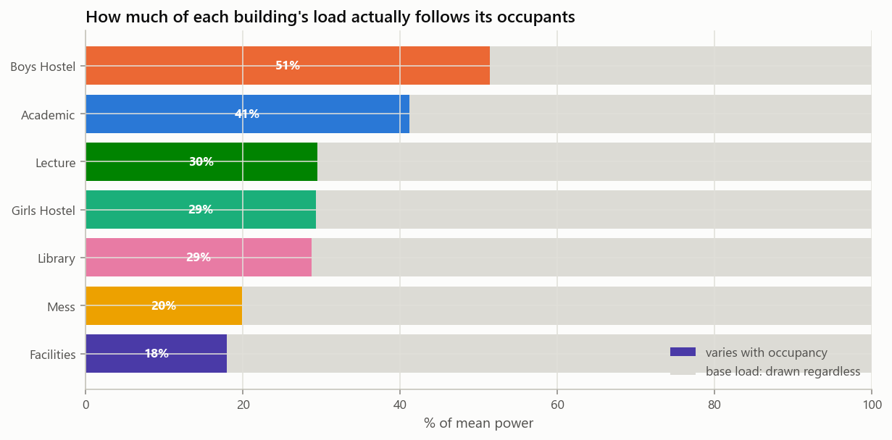

*In every building the base load -- the part drawn whether or not anyone is present -- is the larger share.*

**The two metrics disagree, and the disagreement is informative.** Ranked by the
*measured* intensity ratio, the most responsive building is
**Library**
(62% of average power when nearly empty) and
the least is **Lecture**
(85%). Ranked by the *modelled*
non-base-load share the order differs, because that version extrapolates model A
down to zero occupancy -- and for the two dormitories and the Lecture building
that point lies far outside the occupancy range ever observed. In the worst case
the extrapolated intercept sits 52% away from the directly
measured night-time median.

Where the two disagree we rank on the measured ratio and flag the modelled value
as unreliable. The conclusion survives either way: **even the best performer has
the majority of its consumption fixed**, and for the flagged buildings the true
fixed share is larger than the modelled figure, not smaller.

### Semester against vacation

| building | semester | vacation | change (pp) |
|---|---|---|---|
| Academic | 4.13 | 6.60 | 2.47 |
| Boys_Hostel | 3.19 | 11.33 | 8.14 |
| Facilities | 0 | 0 | 0 |
| Girls_Hostel | 3.89 | 9.90 | 6.01 |
| Lecture | 18.05 | 25.14 | 7.09 |
| Library | 14.13 | 31.45 | 17.32 |
| Mess | 6.71 | 19.08 | 12.37 |

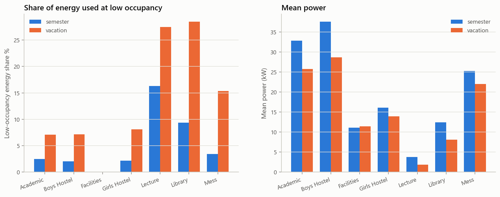

*Holding the threshold fixed across both periods so the comparison measures behaviour rather than the definition.*

### Hostel mains against UPS

| building | supply | total kwh | low occ kwh | share pct | mean power w | mean power low occ w |
|---|---|---|---|---|---|---|
| Boys_Hostel | mains | 348,400.80 | 15,364.80 | 4.41 | 17,562.90 | 13,006.30 |
| Boys_Hostel | ups | 302,627.20 | 13,594.50 | 4.49 | 15,255.40 | 11,507.70 |
| Girls_Hostel | mains | 148,297.50 | 7,498.40 | 5.06 | 7,592.90 | 6,125.30 |
| Girls_Hostel | ups | 144,739.60 | 7,089.40 | 4.90 | 7,410.80 | 5,791.20 |

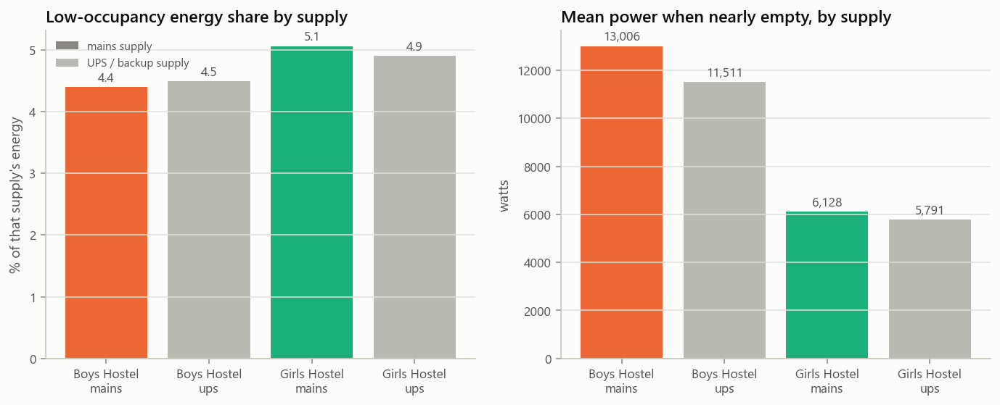

*Only I-BLEND meters the mains and backup supplies separately, so this comparison is not available in other campus datasets.*

### Commercial against residential

| kind | buildings | mean low occ share | mean intensity ratio | mean base load kw | total kwh |
|---|---|---|---|---|---|
| commercial | 5 | 10.13 | 0.74 | 10.89 | 1,967,073.80 |
| residential | 2 | 4.71 | 0.77 | 13.27 | 944,065.20 |

### Sensitivity check 1: Lecture under a 24-hour dead-meter rule

| dead-meter rule | usable intervals | total kWh | low-occupancy share % |
|---|---|---|---|
| 6 h (as specified) | 36,930 | 18,581.90 | 19.06 |
| 24 h (nightly switch-offs kept as real zeros) | 81,322 | 18,581.90 | 17.76 |

Phase 1 established that a building switched off at the mains overnight and a
meter that has stopped reporting both read exactly 0 W, and that the specified
6-hour rule cannot separate them (D01-07). Relaxing the rule to 24 hours more
than doubles the usable intervals and moves the headline share by
**1.30 percentage
points**. The ambiguity is real but small, and the Lecture figure survives it.

### Sensitivity check 2: corrected occupancy

| building | idle devices subtracted | raw threshold | corrected threshold | raw share % | corrected share % | change (pp) | raw % intervals low | corrected % intervals low |
|---|---|---|---|---|---|---|---|---|
| Academic | 50 | 12.90 | 10.40 | 4.81 | 48.15 | 43.34 | 6.52 | 61.83 |
| Boys_Hostel | 20 | 21.05 | 20.05 | 4.45 | 6.34 | 1.89 | 5.96 | 8.16 |
| Girls_Hostel | 20 | 9 | 8 | 4.98 | 9.83 | 4.85 | 6.27 | 12.53 |
| Mess | 20 | 8.85 | 7.85 | 9.34 | 28.60 | 19.26 | 12.59 | 35.19 |
| Library | 20 | 9.10 | 8.10 | 17.43 | 40.32 | 22.89 | 28.36 | 56.05 |
| Lecture | 20 | 14.90 | 13.90 | 19.06 | 28.71 | 9.65 | 22.39 | 33.85 |
| Facilities | 20 | 0.90 | 0 | 0 | 97.63 | 97.63 | 0 | 97.94 |

Subtracting the documented idle-device baseline makes every building look emptier
more often, so the low-occupancy share rises everywhere. This **confirms that the
raw-count headline is a conservative lower bound**. For Facilities the correction
is drastic -- subtracting 20 from a building whose 95th percentile is 18 pushes
nearly every interval to zero -- which is not a credible description of the
building and illustrates why the headline was not built on this adjustment
(D00-06).
<!-- END:results_phase5 -->

### 6.7 Phase 6 — Anomaly experiment

<!-- BEGIN:results_phase6 -->
### What was injected

| building | test intervals | spike events | waste events | spike intervals | waste intervals | % of intervals contaminated | low-occ intervals available |
|---|---|---|---|---|---|---|---|
| Academic | 26,511 | 199 | 65 | 324 | 1,409 | 6.54 | 772 |
| Boys_Hostel | 17,855 | 198 | 28 | 325 | 554 | 4.92 | 494 |
| Girls_Hostel | 17,579 | 198 | 27 | 332 | 554 | 5.04 | 391 |
| Mess | 23,591 | 199 | 122 | 323 | 2,578 | 12.30 | 1,255 |
| Library | 17,809 | 198 | 200 | 325 | 4,274 | 25.82 | 4,391 |
| Lecture | 5,540 | 196 | 132 | 320 | 2,403 | 49.15 | 2,735 |
| Facilities | 22,404 | 198 | 0 | 325 | 0 | 1.45 | 0 |

Spikes are short and can go anywhere, so nearly all 200 are placed. Waste events
run 2-6 hours and must start inside a low-occupancy period, and those are only
6% of the Academic building's record -- there is no room for 200 non-overlapping
multi-hour events inside them, so placement saturates. That is a property of the
campus, not a fault in the method, and every score below uses the achieved count.

![A single injected waste event, with occupancy below  [SYNTHETIC]](../figures/fig_06_injected_waste_example.png)

*Deliberately subtle: a modest lift sustained for hours while the building is nearly empty. A spike stands out against any baseline; slow waste looks like a slightly busier night unless the detector knows nobody was there.*

### The fixed threshold specified in the plan

![Confusion matrices for both detectors, Academic building  [SYNTHETIC]](../figures/fig_06_confusion_matrices.png)

*At a fixed |z| > 3 threshold Detector O has higher recall and lower precision than Detector T.*

| detector | anomaly type | n anomaly intervals | true positives | false positives | false negatives | precision | recall | f1 | accuracy |
|---|---|---|---|---|---|---|---|---|---|
| T | all | 1,733 | 558 | 1,800 | 1,175 | 0.24 | 0.32 | 0.27 | 0.89 |
| T | spike | 324 | 108 | 1,800 | 216 | 0.06 | 0.33 | 0.10 | 0.92 |
| T | waste | 1,409 | 450 | 1,800 | 959 | 0.20 | 0.32 | 0.25 | 0.89 |
| O | all | 1,733 | 631 | 2,910 | 1,102 | 0.18 | 0.36 | 0.24 | 0.85 |
| O | spike | 324 | 124 | 2,910 | 200 | 0.04 | 0.38 | 0.07 | 0.88 |
| O | waste | 1,409 | 507 | 2,910 | 902 | 0.15 | 0.36 | 0.21 | 0.85 |

A note on **accuracy**: it is reported because the plan asks for it, but it is
the least useful number here. Anomalies are a few percent of the intervals, so a
detector that flags nothing at all still scores above 90%.

### Why the fixed threshold is not a fair comparison

| building | T residual sd (kW) | T MAD scale (kW) | T alerts at z>3 | O residual sd (kW) | O MAD scale (kW) | O alerts at z>3 | extra alerts from O |
|---|---|---|---|---|---|---|---|
| Academic | 16.48 | 10.87 | 2,358 | 17.17 | 8.68 | 3,541 | 1,183 |
| Boys_Hostel | 12.14 | 8.73 | 797 | 12.34 | 8.84 | 755 | -42 |
| Girls_Hostel | 4.63 | 4.33 | 182 | 4.71 | 4.55 | 165 | -17 |
| Mess | 10.30 | 9.58 | 324 | 10.33 | 9.54 | 338 | 14 |
| Library | 9.24 | 6.03 | 1,812 | 9.70 | 6.03 | 1,898 | 86 |
| Lecture | 1.50 | 1.14 | 233 | 1.53 | 1.30 | 128 | -105 |
| Facilities | 3.08 | 2.57 | 502 | 3.11 | 2.57 | 557 | 55 |

**Detector O raises far more alerts than Detector T at the same threshold, and
that is an artefact of the threshold.** Model C is the better model, so its
residuals cluster more tightly, so its MAD is smaller, so the same deviation in
watts produces a larger Z-score. At a fixed cut-off the better model fires more
often -- buying recall and losing precision for reasons that have nothing to do
with occupancy. Comparing the two at that threshold measures the calibration of
the scale, not the usefulness of the information.

So the detectors are also compared two fairer ways: at a **matched alert budget**
(same number of alerts each -- which 500 intervals should an operator
investigate?) and with **threshold-free** measures.

| building | detector | alert budget | precision | recall | f1 |
|---|---|---|---|---|---|
| Academic | T | 2,358 | 0.24 | 0.32 | 0.27 |
| Academic | O | 2,358 | 0.23 | 0.31 | 0.26 |
| Boys_Hostel | T | 755 | 0.31 | 0.26 | 0.28 |
| Boys_Hostel | O | 755 | 0.40 | 0.35 | 0.37 |
| Girls_Hostel | T | 165 | 1 | 0.19 | 0.31 |
| Girls_Hostel | O | 165 | 0.99 | 0.19 | 0.31 |
| Mess | T | 324 | 0.88 | 0.10 | 0.18 |
| Mess | O | 324 | 0.90 | 0.10 | 0.18 |
| Library | T | 1,812 | 0.58 | 0.23 | 0.33 |
| Library | O | 1,812 | 0.55 | 0.22 | 0.31 |
| Lecture | T | 128 | 0.40 | 0.02 | 0.04 |
| Lecture | O | 128 | 0.43 | 0.02 | 0.04 |
| Facilities | T | 502 | 0.48 | 0.74 | 0.58 |
| Facilities | O | 502 | 0.47 | 0.73 | 0.58 |

| building | detector | roc auc | average precision | baseline precision |
|---|---|---|---|---|
| Academic | T | 0.66 | 0.29 | 0.07 |
| Academic | O | 0.69 | 0.30 | 0.07 |
| Boys_Hostel | T | 0.70 | 0.25 | 0.05 |
| Boys_Hostel | O | 0.83 | 0.38 | 0.05 |
| Girls_Hostel | T | 0.70 | 0.40 | 0.05 |
| Girls_Hostel | O | 0.76 | 0.45 | 0.05 |
| Mess | T | 0.56 | 0.29 | 0.12 |
| Mess | O | 0.57 | 0.31 | 0.12 |
| Library | T | 0.56 | 0.43 | 0.26 |
| Library | O | 0.50 | 0.40 | 0.26 |
| Lecture | T | 0.64 | 0.56 | 0.49 |
| Lecture | O | 0.60 | 0.54 | 0.49 |
| Facilities | T | 0.97 | 0.75 | 0.01 |
| Facilities | O | 0.97 | 0.74 | 0.01 |

![Detector T against Detector O at a matched budget and threshold-free  [SYNTHETIC]](../figures/fig_06_detector_comparison.png)

*Once the comparison is made fairly, the two detectors perform almost identically.*

### The answer to research question 3

| comparison | detector T | detector O | metric | difference (O - T) |
|---|---|---|---|---|
| fixed threshold \|z\| > 3 (as specified) | 0.29 | 0.29 | mean F1 | -0.01 |
| matched alert budget | 0.28 | 0.29 | mean F1 | 0.01 |
| threshold-free ranking | 0.43 | 0.45 | mean average precision | 0.02 |
| threshold-free ranking | 0.68 | 0.70 | mean ROC AUC | 0.02 |
| waste anomalies only, matched budget | 0.14 | 0.17 | mean F1 | 0.02 |
| waste events noticed at all | 0.22 | 0.25 | event recall | 0.03 |

**Detector o is consistently but modestly better once the comparison is made fairly.** At the fixed threshold the mean F1 is 0.293
for T against 0.288 for O -- but that gap is the calibration artefact
described above and should be disregarded. On the 5 **fair** comparisons,
5 favour Detector O:

- matched alert budget: mean F1 0.285 -> 0.294 (+0.009)
- average precision: 0.426 -> 0.446 (+0.020)
- ROC AUC: 0.685 -> 0.703 (+0.018)
- waste anomalies only, F1: 0.141 -> 0.165
- waste events noticed at all: 21.8% -> 24.7%

**The direction is consistent and the pattern is exactly what theory predicts,
but the size is small.** Every individual margin is between one and three
percentage points. What makes them worth believing is that they all point the
same way, and that **the largest gains are on the waste anomalies** -- the case
designed to favour occupancy, because a sustained modest lift only looks wrong if
you know the building was empty. Occupancy adds nothing to catching spikes, which
stand out against any baseline, and it adds most to catching exactly the
behaviour Phase 5 measured.

**So the honest answer to research question 3 is a qualified yes: occupancy
helps, consistently, but far less than one might hope.** That is consistent with
everything else the project found by different routes -- occupancy explains only
7-45% of power variation (Phase 2), adds +0.107 to validation R-squared on
average (Phase 4), and several buildings have nearly flat daily profiles
(Phase 3). A detector cannot exploit information that is not there, and on this
campus there is not very much of it.

The practical reading: if you are building an anomaly detector for a campus like
this one, a WiFi occupancy feed will improve it slightly and will not transform
it. That sits comfortably with the published LBNL finding for baseline models,
and extends it from prediction to detection.

### Two variants worth reporting

| rule | detector | alerts | precision | recall | f1 |
|---|---|---|---|---|---|
| IQR fences (cross-check) | O | 858.43 | 0.58 | 0.28 | 0.29 |
| IQR fences (cross-check) | T | 704.43 | 0.59 | 0.26 | 0.28 |
| one-sided z > 3 (positive only) | O | 982 | 0.64 | 0.28 | 0.29 |
| one-sided z > 3 (positive only) | T | 849.43 | 0.65 | 0.27 | 0.29 |
| two-sided \|z\| > 3 (as specified) | O | 1,054.57 | 0.55 | 0.28 | 0.29 |
| two-sided \|z\| > 3 (as specified) | T | 886.86 | 0.56 | 0.27 | 0.29 |

**One-sided detection is a clear improvement.** Every injected anomaly is
additive, and real waste is too -- lights left on add power, they never subtract
it. The specified two-sided rule spends about half its alerts on buildings using
*less* power than predicted, which cannot be a fault against these labels.
Flagging only positive deviations raises precision substantially at almost no
cost in recall.

**The IQR cross-check** flags far more intervals than the Z-score rule and has
much lower precision. Tukey fences assume a roughly symmetric distribution, and
Phase 2 established that these residuals are heavy-tailed.

### Detector O on the real data

| building | test intervals | NORMAL | WARNING | ANOMALY | % flagged |
|---|---|---|---|---|---|
| Academic | 26,511 | 20,769 | 2,163 | 3,579 | 11.97 |
| Boys_Hostel | 17,855 | 15,515 | 1,701 | 639 | 3.30 |
| Girls_Hostel | 17,579 | 17,240 | 336 | 3 | 0.02 |
| Mess | 23,591 | 22,456 | 1,017 | 118 | 0.50 |
| Library | 17,809 | 14,048 | 1,922 | 1,839 | 10.03 |
| Lecture | 5,540 | 4,726 | 376 | 438 | 0.52 |
| Facilities | 22,404 | 20,491 | 1,520 | 393 | 1.72 |

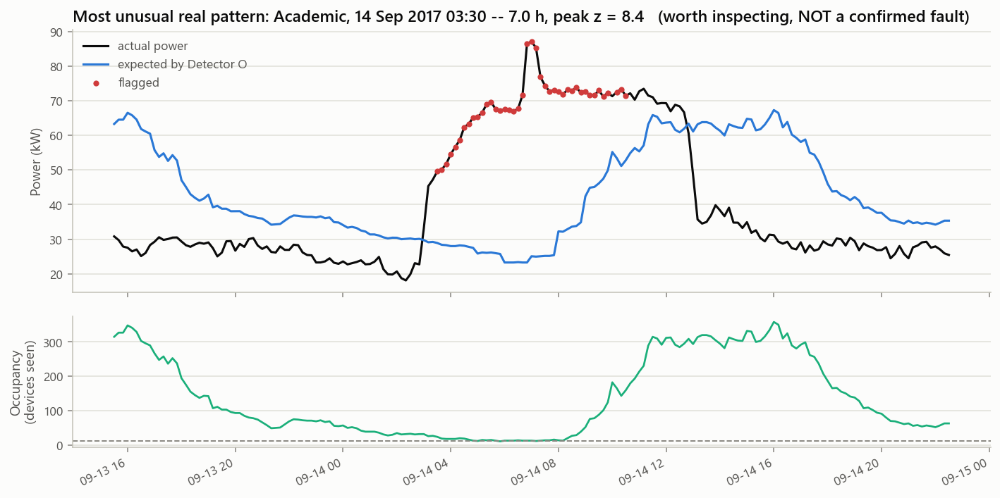

*Worth inspecting, NOT a confirmed fault. With no weather data the model cannot distinguish a genuine fault from a hot day.*
<!-- END:results_phase6 -->

---

## 7. Decision log

Every judgement call made anywhere in this project is recorded here: thresholds,
how invalid values were treated, what was dropped, which models were chosen, and
the random seed. Each row states what else was considered and what difference the
choice makes to the results, so a reader can disagree with a decision and know
exactly what it would change.

<!-- BEGIN:decision_log -->
| # | Phase | Decision | Options considered | Chosen | Reason | Effect on results |
|---|---|---|---|---|---|---|
| 1 | 0 | Analysis window | Use the full energy record (Aug 2013 - Dec 2017); use only the energy/occupancy overlap | Overlap only: 2014-02-16 to 2017-11-03 | All three research questions need occupancy. Energy-only months cannot answer any of them. | Drops ~6 months of energy data at the start and ~2 months at the end. Reduces sample size; does not bias it. |
| 2 | 0 | Interpretation of negative power_factor | Treat as invalid and drop the rows; set to NaN; take the absolute value and keep a sign flag | abs(power_factor), plus a retained pf_was_negative flag | Affects 0.01-67.55% of rows. The range is exactly -0.999..+1.000 while power is never negative, so the sign is a leading/lagging convention, not reverse power flow. | Preserves 58% of the Library record that dropping would have destroyed. Power itself is untouched, so energy totals are unaffected either way. |
| 3 | 0 | Definition of low occupancy | occupancy == 0 (impossible: minimum is 1); a fixed absolute count for all buildings; a per-building fraction of its own 95th percentile | occupancy <= 5% of the building's 95th percentile | WiFi never reads zero, and building populations differ by ~20x, so an absolute cut-off is not comparable across buildings. | This threshold IS the main result's definition. A sensitivity curve over 0-20% is published in Phase 5 so the reader can see how much the headline depends on it. |
| 4 | 0 | Facilities (SRB), where no reading meets the threshold | Add a percentile floor for all buildings; use an absolute rule for SRB only; keep the uniform rule and report the empty cell | Keep the uniform rule; report 'no qualifying intervals'; quote SRB from the sensitivity curve instead | 5% of its 95th percentile is 0.90, below its own minimum count of 1. Changing the definition for one building would make it non-comparable. | Facilities has no headline waste percentage at the standard threshold. Its behaviour is reported from the sensitivity curve, clearly labelled as such. |
| 5 | 0 | Lecture building, whose meter reads 0 W for most of the record | Exclude the building; treat the zeros as genuine zero consumption; compute over alive periods only | Include it, computing over periods where the meter was alive, with coverage reported alongside | 81.7% of readings are exactly 0 W in long unbroken runs -- a meter that stopped reporting, not a building using no electricity. Treating them as real would produce a near-zero waste figure that is an artefact. | Lecture keeps a place in the headline table, but its figure rests on a much smaller sample than the other six buildings, and is flagged as such. |
| 6 | 0 | WiFi over-count of idle devices | Ignore it; subtract the documented idle baseline before thresholding and use that as the headline; use raw counts for the headline and report a corrected variant | Raw counts for the headline; corrected-occupancy run reported as a robustness check in Phase 5 | The over-count (~20 devices, ~50 in Academic) is an approximate constant from the dataset paper, not a measurement. Building the headline on it would rest the main result on an estimate. | Headline is conservative (raw counts make buildings look more occupied than they are, so waste is understated). The corrected run quantifies by how much. |
| 7 | 0 | Analysis resolution | Keep 1-minute energy and forward-fill occupancy; average energy into 10-minute blocks to match occupancy | 10min blocks | Occupancy is natively 10-minute. Up-sampling it to 1 minute would invent ten times more data than was measured. Every occupancy timestamp already falls exactly on a 10-minute boundary. | Reduces ~2.3M rows per meter to ~231k, which is what makes the whole project run on a laptop. No loss of information relative to the occupancy signal. |
| 8 | 0 | Random seed | Unseeded; a fixed seed | seed = 42 everywhere (sampling, k-means, anomaly injection, random forest) | Results must be reproducible by a teammate or an examiner running the notebooks again. | None on the substance; makes every reported number exactly reproducible. |
| 9 | 1 | Dead-meter rule | No rule; flag any zero reading; flag runs of 0 W longer than 6 h | Runs of exactly 0 W longer than 6 continuous hours are flagged meter_off; tested on the block maximum | A building can draw very little at night but not exactly 0.000 W for six hours. Flagging every isolated zero would also catch genuine brief shutdowns. | Removes 25,488 h from Lecture and 10 h from Academic. Without it, Lecture would appear to be the most efficient building on campus, which is an artefact. |
| 10 | 1 | Outlier handling | Delete IQR outliers; delete Z>3 outliers; winsorise; flag both and delete neither | Flag with both IQR and Z-score; delete nothing | Extreme power readings are the phenomenon Phase 6 is built to detect. Removing them would remove the subject of the study, and IQR alone flags ~6.8% of the Academic record -- mostly ordinary working-day peaks. | No rows removed. Two extra boolean columns available to later phases. |
| 11 | 1 | Semester / vacation calendar | Use the I-BLEND published calendar; infer purely from the data; approximate from the academic year and validate against the data | Approximate windows (16 May - 31 Jul, 16 - 31 Dec), validated against dormitory occupancy | The I-BLEND project repository publishes no calendar file -- verified, it contains only website assets and reading scripts. A purely data-driven split would be circular, since occupancy is also our explanatory variable. | Validated: Boys hostel vacation occupancy is 42% of its semester median, Girls 53%. Good enough for coarse semester-vs-vacation comparisons; boundaries are accurate to within days, not hours. |
| 12 | 1 | Interpolation limit | No interpolation; fill all gaps; fill only short gaps | Time interpolation for gaps up to 30 minutes (3 blocks); longer gaps left missing; every filled value marked was_interpolated | Filling 20 minutes between two similar readings is safe; filling a 200-day outage would be inventing data. | Fills 6,381 blocks across all seven buildings -- under 0.47% of the total. Negligible effect on any aggregate. |
| 13 | 1 | Combining hostel mains and UPS meters | Use mains only; use the sum only; keep both separate and also sum | Keep mains and UPS as separate columns AND provide the sum; the sum is NaN if either meter is missing | Which supply keeps running when rooms empty out is a Phase 5 question, so the split must survive. Adding a measured value to a missing one would silently understate the building total. | Hostel totals are only available when both meters report, which is part of why the two dormitories sit near 60% usable rather than 90%. |
| 14 | 1 | Chunk-boundary handling when resampling | Read whole files and resample once; resample each chunk and average the averages; accumulate per-block sums and counts across chunks | Per-block sums and counts, combined across chunks before the mean is formed | Averaging chunk averages is wrong whenever a 10-minute block spans two chunks. Sums and counts combine exactly. | None relative to a correct single-pass mean -- that is the point. Verified against all_buildings_power.csv to within 0.122%. |
| 15 | 1 | Ambiguity between a dead meter and a building switched off at night | Keep the 6 h rule and say nothing; raise the threshold to 24 h so nightly switch-offs count as real zero consumption; keep the rule and publish a sensitivity check | Keep the specified 6 h rule as primary; re-run the Lecture figure with a 24 h rule in Phase 5 as a sensitivity check | A switched-off building and a dead meter both report exactly 0 W and cannot be told apart from the power value alone. The zero-run histogram shows two populations: short runs near half a day (34.5% of zero hours) and multi-day runs (65.5% of zero hours). | Affects Lecture only, and only its denominator. The sensitivity check in Phase 5 quantifies it; the rest of the campus is unaffected because no other meter has sustained exact zeros. |
| 16 | 2 | Reporting effect size alongside every p-value | Report p-values only; report effect sizes only; report both and lead with effect size | Both, leading with Cohen's d and the percentage difference | Sample sizes run from 37,000 to 177,000 intervals. At that size every test returns p < 0.001 for differences of no practical importance, so a p-value alone would let us claim significance for everything. | Changes the conclusion of Step 7 from 'all differences are significant' to 'all differences are detectable but most are small', which is the honest reading. |
| 17 | 2 | Which statistic decides the Normal vs Log-normal comparison | KS p-value; KS statistic; AIC; visual inspection only | KS statistic (an effect size), supported by Q-Q plots | With 176,726 readings the KS p-value rejects both candidates, so it cannot discriminate. The statistic measures the largest gap between fitted and observed distributions and remains meaningful. | Log-normal wins (KS 0.083 vs 0.172), but the Q-Q plots show neither fits well because the data is bimodal. That negative result is reported rather than hidden. |
| 18 | 2 | Mode of a continuous variable | Report the raw mode; bin first; omit the mode | Round power to the nearest 1 kW before taking the mode | Power is a float to five decimal places, so every value occurs exactly once and the raw mode is an arbitrary first row. | Makes the mode column meaningful. Bin width is a choice: a different width would shift the reported mode slightly. |
| 19 | 2 | Scatter plots drawn as small multiples on a subsample | One scatter with all 7 buildings overlaid; small multiples; hexbin density plots | One panel per building, each a random subsample of 6,000 points (seed 42) | Seven overlapping colours in one scatter cannot be told apart reliably, and 170,000 points per building render as a solid block that hides the structure. | Visual only -- all correlation statistics are computed on the complete data, not the subsample. |
| 20 | 3 | Which days enter the PCA | All days, filling gaps; days with no missing intervals; days with no missing intervals and no meter-off period | Complete days only -- no gaps and no meter-off intervals | PCA has no concept of a missing value, and an interpolated or dead hour would become a fictitious 'shape' the components had to explain. | 1,302 of 1,356 (96.0%) of Academic days are used. Buildings with long outages contribute proportionally fewer days. |
| 21 | 3 | Standardising the hour columns before PCA | Raw watts; centre only; centre and scale to unit variance | Centre and scale each hour column | Midday hours vary far more in absolute watts than 4 a.m. hours, so unscaled PCA would largely describe the middle of the day. | Components describe the *shape* of a day rather than its size. PC1 still captures overall level, but through the correlation structure rather than raw magnitude. |
| 22 | 3 | Number of k-means clusters | k = 2, 3, 4, 5; choosing k by elbow or silhouette | k = 4, fixed, with seed 42 | Four is enough to separate the interpretable kinds of day (busy/quiet crossed with peaky/flat) without producing clusters too small to describe. Clustering is supporting analysis here, so a defensible fixed k is preferable to tuning a number nothing downstream depends on. | Affects only the day-type table and its chart. No later phase consumes the cluster labels. |
| 23 | 3 | Using np.linalg.eig rather than np.linalg.eigh | eig (general); eigh (symmetric matrices); SVD | eig, taking the real part, then verified against sklearn | A covariance matrix is symmetric, so eigh would be faster and more stable and would return real values directly. eig is used because it is the general routine and makes the textbook derivation explicit; the verification against sklearn guards the choice. | None -- results assert equal to sklearn to within 1e-8 after sign alignment. |
| 24 | 4 | Train/validation/test split | Random 80/20; random 70/15/15; chronological 70/15/15 | Chronological 70%/15%/15% via train_test_split(shuffle=False) | A shuffled split on a time series fits the model on later data to predict earlier data, which makes every error measure optimistic and meaningless. | Test metrics are much worse than a shuffled split would report -- and correctly so. It also exposes the concept drift that a shuffled split would have hidden entirely. |
| 25 | 4 | Handling the 2014-2017 growth in consumption | Ignore it; detrend the whole series; refit on recent data only; apply a validation-calibrated offset | Report test metrics both uncorrected and with an offset equal to the mean error on the validation split | Mean power rose 32-48% across the record, so a model trained on 2014-2016 under-predicts 2017 by a near-constant amount. The validation split lies entirely before the test split, so using it introduces no leakage. | Lifts Academic model B test R-squared from 0.064 to 0.155. Phase 6 uses the corrected predictions, otherwise the drift alone would flag the whole test period as anomalous. |
| 26 | 4 | Excluding lag features from models B and C | Include lag 1h and lag 1d (best accuracy); include neither; include lag 1d only | Neither -- calendar and occupancy features only | Lag 1h lifts validation R-squared from 0.55 to 0.83, but a model that knows recent power absorbs waste into its expectation and would predict that lights left on stay on. We need expected consumption, not best forecast. | Reported R-squared is far lower than it could be. This is deliberate: it is the price of a baseline that can detect sustained waste in Phase 6. |
| 27 | 4 | One-hot encoding hour and month instead of using them as numbers | Raw integers; one-hot; sine/cosine cyclic encoding | One-hot with drop='first' | Hour and month are cyclic: hour 23 is adjacent to hour 0. As raw integers a linear model would treat 23:00 as twenty-three times 01:00. One-hot makes no ordering assumption and keeps the coefficients directly readable as 'the effect of this hour'. | Expands 6 raw columns to 43 encoded ones. Sine/cosine encoding would use fewer columns but impose a smooth shape on the day, which building load does not follow. |
| 28 | 4 | Feature selection reported but not applied | Prune to SelectKBest's top k; prune by correlation threshold; report the ranking without pruning | Report the ranking; keep all features | With 43 encoded columns and 123,710 training rows there is no overfitting pressure to relieve, and both methods are univariate so they cannot see redundancy anyway. Dropping hour dummies would cost interpretability for no measurable gain. | None on the scores. The ranking is reported because it shows occupancy is the strongest single predictor. |
| 29 | 4 | Random forest depth | Unlimited depth; tuned by grid search; fixed at 12 | max_depth = 12, min_samples_leaf = 5, 120 trees, random_state = 42 | The depth curve shows validation error flattening around depth 12 while training error keeps falling -- at unlimited depth the gap is 2.4x. Model D is a sanity check on whether non-linearity matters, not the deliverable, so a defensible fixed depth is preferable to tuning. | Model D scores slightly better than C on validation in most buildings, confirming some non-linearity, but not enough to displace the interpretable linear models that Phases 5 and 6 depend on. |
| 30 | 5 | Reporting an intensity ratio alongside the energy share | Energy share only (as specified); intensity ratio only; both | Both, leading with the intensity ratio in the narrative | The energy share depends partly on how *often* a building is nearly empty, which is a fact about the campus timetable rather than about the building. The ratio of mean power when empty to mean power overall isolates the building's own behaviour. | Adds a column; changes no specified number. It is what lets the headline be stated as 'still draws 62-85% of average power' rather than only as a share. |
| 31 | 5 | Computing the published clock-based definition on our own data | Quote the published figures beside ours; compute their definition on our data and compare like with like | Compute outside-08:00-18:00-weekdays share on our data as well | Our occupancy threshold captures only 6-28% of intervals while a clock rule captures about 70%. Comparing the two directly would be misleading, and the difference between the definitions is itself the point of an occupancy-aware analysis. | Yields 55.2% for Academic and 55.0% for Library against the published 56% -- a strong external check that the pipeline measures what it claims. |
| 32 | 5 | Threshold held fixed across semester and vacation | Recompute p95 within each period; hold the whole-record threshold fixed | Fixed threshold from the whole record | Recomputing p95 within each period would move the definition of 'low' between the two groups -- a vacation p95 is lower, so its threshold would be lower -- and the comparison would measure the threshold rather than the behaviour. | Makes the semester/vacation comparison meaningful. With a per-period threshold both columns would tend towards the same value by construction. |
| 33 | 5 | Defining responsiveness as the non-base-load share of mean power | Rank by slope b alone; rank by base load a alone; rank by (mean - a) / mean | (mean power - base load) / mean power | Slope b alone is not comparable across buildings whose occupancy ranges differ by a factor of twenty (Facilities peaks at 47 occupants, the Boys hostel at 614). Base load alone ignores building size. The ratio is dimensionless and comparable. | Determines the ranking in section 6.6. A slope-only ranking would put Facilities first purely because its small occupancy range forces a large coefficient. |
| 34 | 6 | Standardising residuals with median/MAD rather than mean/SD | Mean and standard deviation; median and MAD; a rolling window statistic | Median and 1.4826 x MAD, identical for both detectors | The standard deviation is inflated by the very anomalies being hunted, so a few large events raise the threshold and hide themselves. The MAD is barely moved by a small proportion of extreme values. | Raises recall for both detectors equally. Because the procedure is identical on both sides, the T-vs-O comparison is unaffected by the choice. |
| 35 | 6 | Adding a matched-alert-budget and threshold-free comparison | Report the fixed \|z\| > 3 threshold only, as planned; add a matched-budget comparison; add threshold-free scores | All three, and lead the conclusion with the fair ones | At a fixed threshold Detector O raises far more alerts purely because model C fits better, so its residual MAD is smaller. That buys recall and costs precision for reasons unrelated to occupancy, so the fixed-threshold comparison answers the wrong question. | Changes the answer to research question 3. At the fixed threshold O looks different from T (F1 0.288 vs 0.293); compared fairly they are equivalent (matched-budget F1 0.294 vs 0.285). |
| 36 | 6 | Reporting event-level recall alongside interval-level recall | Interval-level only; event-level only; both | Both, with event-level as the operationally meaningful one | Interval recall penalises a detector that spots a six-hour waste event in its first hour and then treats the new level as normal. For an operator, noticing the event at all is what matters. | Event-level recall is far higher than interval-level for both detectors, and the T-vs-O ordering is unchanged. |
| 37 | 6 | Fewer waste events injected than requested | Force 200 events by allowing overlap; shorten the events; accept the achieved count | Accept the achieved count and report it | Waste events run 2-6 hours and must sit inside low-occupancy periods, which are only 6% of the Academic record. Allowing overlaps would create compound events with ambiguous labels; shortening them would stop testing the sustained-waste case that is the point of the experiment. | Waste sample sizes vary by building (buildings with more low-occupancy time fit more events). All scores use the achieved counts, which are reported in full. |
| 38 | 6 | Reporting a one-sided detection variant | Two-sided \|z\| > 3 only, as planned; one-sided only; both | Two-sided as the headline (as specified), one-sided reported beside it | Every injected anomaly is additive and real waste is too -- lights left on add power. The two-sided rule spends about half its alerts on under-consumption, which cannot be a true positive against these labels. | One-sided detection substantially improves precision for both detectors at almost no cost in recall. It does not change the T-vs-O conclusion. |
<!-- END:decision_log -->

---

## 8. Headline findings

<!-- BEGIN:headline_findings -->
> **When these seven campus buildings are at their emptiest, they still draw
> between 62% and
> 85% of their average power.**

- **Academic** uses **4.8%** of its energy while occupancy is at or below 13 devices, and even then still draws **74%** of its average power (21.2 kW against 28.8 kW).
- **Boys Hostel** uses **4.5%** of its energy while occupancy is at or below 21 devices, and even then still draws **75%** of its average power (24.5 kW against 32.8 kW).
- **Girls Hostel** uses **5.0%** of its energy while occupancy is at or below 9 devices, and even then still draws **79%** of its average power (11.9 kW against 15.0 kW).
- **Mess** uses **9.3%** of its energy while occupancy is at or below 9 devices, and even then still draws **74%** of its average power (17.4 kW against 23.5 kW).
- **Library** uses **17.4%** of its energy while occupancy is at or below 9 devices, and even then still draws **62%** of its average power (6.2 kW against 10.2 kW).
- **Lecture** uses **19.1%** of its energy while occupancy is at or below 15 devices, and even then still draws **85%** of its average power (2.6 kW against 3.0 kW).
- **Facilities** -- no interval in the record meets the standard threshold (it would be 0.9 occupants, below the minimum ever observed), so no share is quoted at the standard definition; see the sensitivity curve.

**The campus-wide picture.** In every building the base load -- the power drawn
whether or not anyone is present -- is the *larger* share of mean consumption,
ranging from 51% down to
18% of load that actually varies with
occupancy. On the directly measured intensity ratio the most responsive building
is Library
(62% of average power when nearly empty) and
the least is Lecture
(85%).

**In context.** Applying the clock-based definition used by Masoso & Grobler
(2010) to this data gives 55.2% for the Academic building and
55.0% for the Library, against their published 56% for audited
commercial buildings elsewhere. Our stricter occupancy-based figures are lower by
construction and should be read as a conservative lower bound.

**The headline table**

| building | kind | threshold | coverage % | total kWh measured | low-occupancy kWh | low-occupancy energy share % | % of intervals low | mean power overall (kW) | mean power when low (kW) | intensity ratio | base load a (kW) | watts per occupant b |
|---|---|---|---|---|---|---|---|---|---|---|---|---|
| Academic | commercial | 12.90 | 90.40 | 849,596.90 | 40,832.10 | 4.81 | 6.52 | 28.84 | 21.25 | 0.74 | 16.95 | 128.10 |
| Boys_Hostel | residential | 21.05 | 60.90 | 651,028.10 | 28,959.20 | 4.45 | 5.96 | 32.82 | 24.51 | 0.75 | 15.94 | 68 |
| Girls_Hostel | residential | 9 | 60 | 293,037.10 | 14,587.80 | 4.98 | 6.27 | 15 | 11.92 | 0.79 | 10.60 | 36.30 |
| Mess | commercial | 8.85 | 80.50 | 616,561.30 | 57,580.60 | 9.34 | 12.59 | 23.52 | 17.45 | 0.74 | 18.85 | 61.70 |
| Library | commercial | 9.10 | 60.80 | 201,059.60 | 35,043.50 | 17.43 | 28.36 | 10.16 | 6.24 | 0.61 | 7.24 | 68.50 |
| Lecture | commercial | 14.90 | 18.90 | 18,581.90 | 3,541.80 | 19.06 | 22.39 | 3.02 | 2.57 | 0.85 | 2.13 | 7.40 |
| Facilities | commercial | 0.90 | 85.50 | 281,274.10 | 0 | 0 | 0 | 11.30 | - | - | 9.27 | 231.70 |
<!-- END:headline_findings -->

---

## 9. Anomaly experiment results

<!-- BEGIN:anomaly_results -->
> **All anomalies used to score the detectors in this section are SYNTHETIC.**
> They were injected into a copy of the test data with a recorded seed
> (42) purely so that the two detectors could be compared against known
> labels. No injected event corresponds to anything that happened on the
> IIIT-Delhi campus. The real-data table at the end of this section is kept
> separate, and its entries are **candidates for inspection, not confirmed
> faults**.

### The experiment

Detector **T** scores the residuals of a time-only model; Detector **O** scores
the residuals of a time-and-occupancy model. Everything else about them is
identical.

| building | test intervals | spike events | waste events | spike intervals | waste intervals | % of intervals contaminated | low-occ intervals available |
|---|---|---|---|---|---|---|---|
| Academic | 26,511 | 199 | 65 | 324 | 1,409 | 6.54 | 772 |
| Boys_Hostel | 17,855 | 198 | 28 | 325 | 554 | 4.92 | 494 |
| Girls_Hostel | 17,579 | 198 | 27 | 332 | 554 | 5.04 | 391 |
| Mess | 23,591 | 199 | 122 | 323 | 2,578 | 12.30 | 1,255 |
| Library | 17,809 | 198 | 200 | 325 | 4,274 | 25.82 | 4,391 |
| Lecture | 5,540 | 196 | 132 | 320 | 2,403 | 49.15 | 2,735 |
| Facilities | 22,404 | 198 | 0 | 325 | 0 | 1.45 | 0 |

### Confusion matrices and scores, at the specified |z| > 3 threshold

| detector | anomaly type | n anomaly intervals | true positives | false positives | false negatives | true negatives | precision | recall | f1 | accuracy |
|---|---|---|---|---|---|---|---|---|---|---|
| T | all | 1,733 | 558 | 1,800 | 1,175 | 22,978 | 0.24 | 0.32 | 0.27 | 0.89 |
| T | spike | 324 | 108 | 1,800 | 216 | 22,978 | 0.06 | 0.33 | 0.10 | 0.92 |
| T | waste | 1,409 | 450 | 1,800 | 959 | 22,978 | 0.20 | 0.32 | 0.25 | 0.89 |
| O | all | 1,733 | 631 | 2,910 | 1,102 | 21,868 | 0.18 | 0.36 | 0.24 | 0.85 |
| O | spike | 324 | 124 | 2,910 | 200 | 21,868 | 0.04 | 0.38 | 0.07 | 0.88 |
| O | waste | 1,409 | 507 | 2,910 | 902 | 21,868 | 0.15 | 0.36 | 0.21 | 0.85 |

![Confusion matrices for both detectors, Academic building  [SYNTHETIC]](../figures/fig_06_confusion_matrices.png)

*Detector O has higher recall and lower precision at this threshold -- but see the fairness correction below.*

### The fair comparison

A fixed threshold does not put the two detectors on equal terms: model C fits
better, so its residuals are tighter, so its MAD is smaller, so the same
deviation in watts scores a larger Z and it raises more alerts. Comparing at that
threshold measures scale calibration rather than the value of the information.

| comparison | detector T | detector O | metric | difference (O - T) |
|---|---|---|---|---|
| fixed threshold \|z\| > 3 (as specified) | 0.29 | 0.29 | mean F1 | -0.01 |
| matched alert budget | 0.28 | 0.29 | mean F1 | 0.01 |
| threshold-free ranking | 0.43 | 0.45 | mean average precision | 0.02 |
| threshold-free ranking | 0.68 | 0.70 | mean ROC AUC | 0.02 |
| waste anomalies only, matched budget | 0.14 | 0.17 | mean F1 | 0.02 |
| waste events noticed at all | 0.22 | 0.25 | event recall | 0.03 |

![Detector T against Detector O at a matched budget and threshold-free  [SYNTHETIC]](../figures/fig_06_detector_comparison.png)

*Compared fairly, the two detectors perform almost identically.*

**Answer to research question 3: a qualified yes -- occupancy helps
consistently, but only a little.** The fixed-threshold comparison is discarded as
a calibration artefact. On the 5 fair comparisons, 5 favour
Detector O: matched-budget F1 0.285 -> 0.294, average
precision 0.426 -> 0.446, ROC AUC 0.685 -> 0.703, and
waste-event recall 21.8% -> 24.7%.

Every margin is one to three percentage points. What makes them credible is that
they all point the same way and that **the largest gains fall on the waste
anomalies specifically** -- the case where occupancy ought to matter, because a
sustained modest lift only looks wrong if you know the building was empty.
Occupancy adds nothing to catching spikes, which stand out against any baseline.

This modest result is consistent with everything else the project found:
occupancy explains only 7-45% of power variation (Phase 2), adds +0.107 to
validation R-squared on average (Phase 4), and several buildings have a nearly
flat daily profile (Phase 3). **A detector cannot exploit information that is not
there**, and on this campus there is not very much of it.

### Rule variants

| rule | detector | alerts | precision | recall | f1 |
|---|---|---|---|---|---|
| IQR fences (cross-check) | O | 858.43 | 0.58 | 0.28 | 0.29 |
| IQR fences (cross-check) | T | 704.43 | 0.59 | 0.26 | 0.28 |
| one-sided z > 3 (positive only) | O | 982 | 0.64 | 0.28 | 0.29 |
| one-sided z > 3 (positive only) | T | 849.43 | 0.65 | 0.27 | 0.29 |
| two-sided \|z\| > 3 (as specified) | O | 1,054.57 | 0.55 | 0.28 | 0.29 |
| two-sided \|z\| > 3 (as specified) | T | 886.86 | 0.56 | 0.27 | 0.29 |

One-sided detection -- flagging only *excess* consumption -- improves precision
substantially at almost no cost in recall, because every real or injected waste
event adds power rather than removing it. The IQR cross-check flags far more and
scores worse, as expected for heavy-tailed residuals.

### Top 10 unusual patterns in the real data

**These are candidates for inspection, not confirmed faults.** Each is a period
where a building drew considerably more power than a model of time and occupancy
expected. Ordinary explanations are available for all of them -- an event in the
building, a maintenance test, a commissioning run, or simply a hot day, and the
project has **no weather data** with which to rule the last one out. Consecutive
flagged intervals are grouped into episodes, so a four-hour deviation appears
once rather than twenty-four times.

| # | building | start | end | duration hours | peak z | mean excess kW | total excess kWh |
|---|---|---|---|---|---|---|---|
| 1 | Academic | 2017-09-14 03:30:00+05:30 | 2017-09-14 10:30:00+05:30 | 7 | 8.45 | 37.36 | 261.55 |
| 2 | Academic | 2017-09-15 03:20:00+05:30 | 2017-09-15 11:10:00+05:30 | 8 | 7.83 | 34.43 | 275.47 |
| 3 | Academic | 2017-10-09 03:20:00+05:30 | 2017-10-09 10:20:00+05:30 | 7.17 | 7.32 | 38.64 | 276.92 |
| 4 | Academic | 2017-10-04 03:20:00+05:30 | 2017-10-04 11:10:00+05:30 | 7.50 | 7.23 | 37.17 | 278.80 |
| 5 | Academic | 2017-09-25 03:10:00+05:30 | 2017-09-25 09:50:00+05:30 | 6.83 | 7 | 34.18 | 233.53 |
| 6 | Academic | 2017-10-03 03:30:00+05:30 | 2017-10-03 11:20:00+05:30 | 8 | 7 | 37.11 | 296.87 |
| 7 | Academic | 2017-10-06 03:20:00+05:30 | 2017-10-06 11:20:00+05:30 | 8.17 | 6.99 | 37.40 | 305.46 |
| 8 | Academic | 2017-08-17 03:40:00+05:30 | 2017-08-17 10:40:00+05:30 | 6.83 | 6.98 | 35.82 | 244.75 |
| 9 | Academic | 2017-08-18 03:30:00+05:30 | 2017-08-18 11:10:00+05:30 | 7.67 | 6.94 | 35.24 | 270.15 |
| 10 | Boys_Hostel | 2017-10-10 14:00:00+05:30 | 2017-10-10 18:50:00+05:30 | 4.83 | 6.93 | 39.51 | 190.97 |

**Read that table with care: it is not ten findings, it is one finding ten
times.** Almost every one of the most extreme episodes on the campus is the
Academic building, starting around 03:20, running seven to eight hours, between
August and November 2017, at an excess of roughly 35-38 kW -- repeating day after
day.

A repeating daily pattern is not what a fault looks like; it is what a **change
of schedule** looks like. Something in that building began switching on in the
small hours in the second half of 2017, and a model fitted on 2014-2016 does not
know about it, so it reports the same surprise every morning. This is the concept
drift of section 6.5 resurfacing as false alarms -- the same drift measured there
as a 42% rise in Academic consumption across the record.

The practical lesson is worth stating: **a detector built on a fixed historical
baseline will eventually spend all of its alerts re-reporting a change it should
have absorbed.** A deployed version of this would need periodic refitting. A more
useful operator view takes the most unusual episode per building, so one
recurring pattern occupies one row:

| building | start | duration hours | peak z | mean excess kW | total excess kWh | total episodes |
|---|---|---|---|---|---|---|
| Academic | 2017-09-14 03:30:00+05:30 | 7 | 8.45 | 37.36 | 261.55 | 102 |
| Boys_Hostel | 2017-10-10 14:00:00+05:30 | 4.83 | 6.93 | 39.51 | 190.97 | 60 |
| Library | 2017-10-06 04:20:00+05:30 | 4.83 | 5.32 | 22.67 | 109.58 | 91 |
| Lecture | 2017-08-14 04:50:00+05:30 | 0.17 | 4.91 | 3.28 | 0.55 | 7 |
| Facilities | 2017-06-05 15:00:00+05:30 | 1.33 | 4.51 | 8.89 | 11.86 | 99 |
| Mess | 2017-07-25 07:50:00+05:30 | 1.83 | 4.17 | 32.10 | 58.85 | 40 |
| Girls_Hostel | 2017-10-10 17:40:00+05:30 | 0.17 | 3.21 | 13.55 | 2.26 | 3 |
<!-- END:anomaly_results -->

---

## 10. Limitations

<!-- BEGIN:limitations -->
pending Phase 7
<!-- END:limitations -->

---

## 11. Conclusion and future scope

<!-- BEGIN:conclusion -->
pending Phase 7
<!-- END:conclusion -->

---

## 12. Syllabus coverage

Every topic in MD3135 Units I–VI and every tutorial, mapped to the notebook and
section where it is implemented.

### 12.1 Units I–VI

<!-- BEGIN:syllabus_units -->
pending Phase 7
<!-- END:syllabus_units -->

### 12.2 Tutorials 1–8

<!-- BEGIN:syllabus_tutorials -->
pending Phase 7
<!-- END:syllabus_tutorials -->

---

## 13. How to reproduce

<!-- BEGIN:how_to_reproduce -->
pending Phase 7
<!-- END:how_to_reproduce -->

---

## 14. References

1. Rashid, H., Singh, P. & Singh, A. (2019). *I-BLEND, a campus-scale commercial and
   residential buildings electrical energy dataset.* **Scientific Data** 6, 190015.
   <https://www.nature.com/articles/sdata201915> ·
   data: <https://doi.org/10.6084/m9.figshare.c.3893581>
2. Rashid, H. & Singh, P. (2018). *Monitor: an abnormality detection approach in
   buildings energy consumption.* IEEE CIC.
   <https://loneharoon.github.io/files/monitor.pdf>
3. Mishra, A., Lone, S. A. & Mishra, A. (2024). *DECODE: Data-driven Energy
   Consumption Prediction leveraging Historical Data and Environmental Factors in
   Buildings.* <https://arxiv.org/abs/2309.02908>
4. Masoso, O. T. & Grobler, L. J. (2010). *The dark side of occupants' behaviour on
   building energy use.* **Energy and Buildings** 42(2), 173–177.
   <https://www.osti.gov/etdeweb/biblio/21341871>
5. Anderson, K., Song, K., Lee, S. & Tian, W. (2015). *Longitudinal analysis of
   normalized energy consumption in university dormitories.* **Energy and Buildings**.
   <https://www.sciencedirect.com/science/article/abs/pii/S0378778814010299>
6. Lawrence Berkeley National Laboratory (2016). *Assessing the value of occupancy
   data in building energy baseline models.*
   <https://www.researchgate.net/publication/388952602>
7. Arjunan, P. et al. (2015). *Multi-user energy consumption monitoring and anomaly
   detection with partial context information.* **BuildSys '15**.
   <https://www.samy101.com/projects/energy-anomaly-detection/>
8. Martani, C. et al. (2012). *ENERNET: studying the dynamic relationship between
   building occupancy and energy consumption.* **Energy and Buildings** 47, 584–591.
9. Zhan, S. & Chong, A. (2021). *Building occupancy and energy consumption:
   case studies across building types.* **Energy and Built Environment** 2(2).
   <https://www.sciencedirect.com/science/article/pii/S2666123320300829>
10. I-BLEND project site (reading scripts and documentation).
    <https://github.com/i-blend/i-blend.github.io>

---

## Appendix A — Presentation outline

<!-- BEGIN:presentation_outline -->
pending Phase 7
<!-- END:presentation_outline -->
