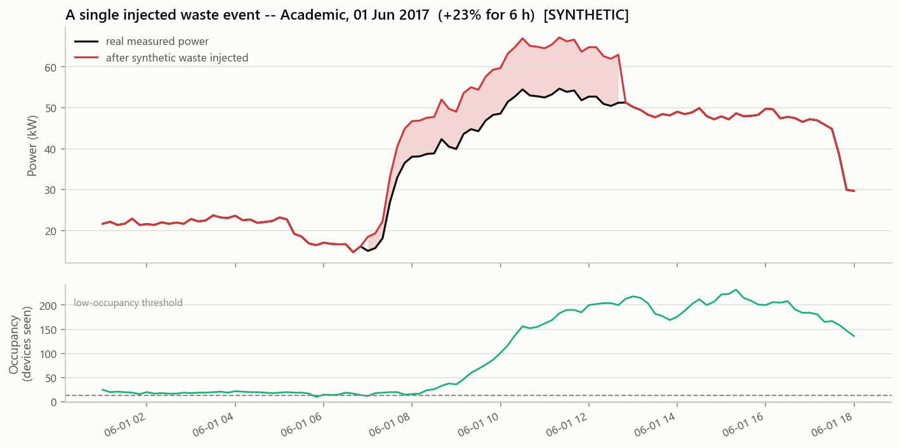
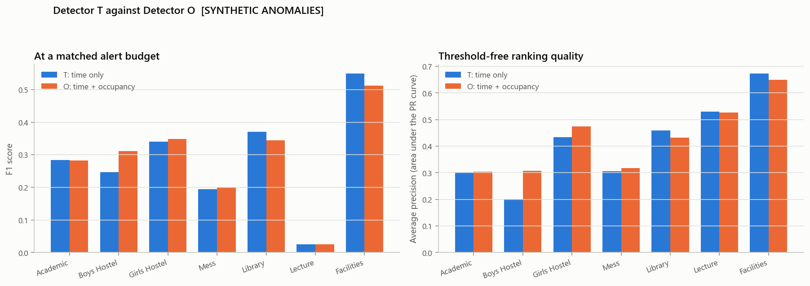
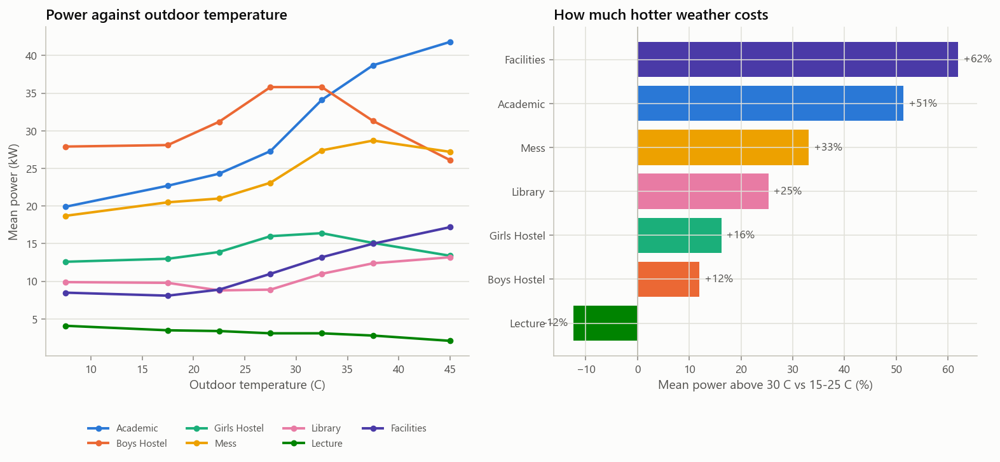
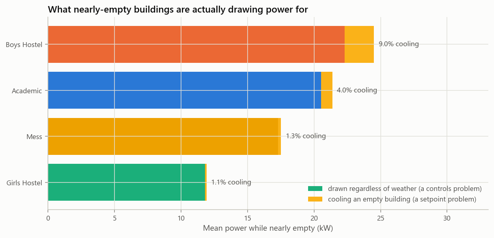
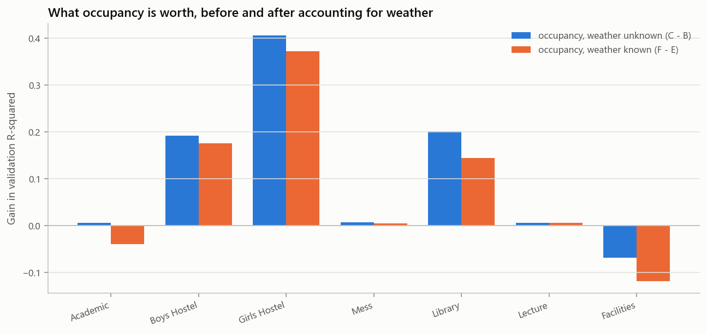

# SMARTGRID-X

**Occupancy-aware energy-waste and anomaly analysis of the I-BLEND campus dataset**

*7 October 2026 · Rajwardhan Shinde*

> This is the readable summary of the project. The full working document is
> [`PROJECT_REPORT.md`](PROJECT_REPORT.md) — 14 sections, ~30,900 words, every
> number generated from executed code. Start here; go there for the detail.

---

## At a glance

**When these seven campus buildings are at their emptiest, they still draw
62–85% of their average power.** In every one of them, the base load — the part
drawn whether or not anyone is present — is the larger share of consumption.

SMARTGRID-X pairs four years of 1-minute electricity readings from seven
IIIT-Delhi buildings with WiFi-derived occupancy counts, and asks what the
campus spends on empty rooms. The novelty claim is narrow and defensible: this
is the first occupancy-aware energy-waste and anomaly analysis of the I-BLEND
dataset. I-BLEND has been published and re-used, but as an energy dataset; its
occupancy half has not been used to ask what the energy was *for*.

| # | Question | Answer |
|---|---|---|
| 1 | What share of each building's energy is used during low-occupancy periods? | 4.4% to 19.1% of total energy, in 6.5% to 28.4% of the time. The sharper number is the intensity ratio: power when nearly empty is 62–85% of average. |
| 2 | How well do occupancy and time predict power? | Weakly, and more weakly than it first looks. Occupancy adds +0.107 validation R² over a time-only model, but only +0.078 once outdoor temperature is also known. |
| 3 | Does an occupancy-aware anomaly detector beat a time-only one? | Yes, on all five fair comparisons — but by one to three percentage points, with the gain concentrated on sustained waste rather than spikes. |

A fourth question was added once weather data was found for the exact analysis
window: **how much of that low-occupancy power is air conditioning?** Between 1%
and 9%, in the four buildings where the split can be identified at all. The
waste is a controls and scheduling problem, not a thermostat problem — which
makes it cheaper to fix.

One thing was found without being looked for: **campus consumption grew 32–48%
between 2014 and 2017.**

The project is 9 executed notebooks, 17 analysis modules, 47 figures, 50 result
tables, a 48-row decision log and a 30,900-word report, with a Streamlit
dashboard over the top.

---

## The dataset

**I-BLEND** (Rashid, Singh & Singh, *Scientific Data* 6:190015, 2019) is a
campus-scale dataset from IIIT-Delhi: about 1.6 GB of 1-minute electrical
readings from seven buildings, four of them commercial and two residential,
spanning **16 February 2014 to 3 November 2017**. We use four sources.

| Source | What it gives | Shape |
|---|---|---|
| Energy meters | Active power per building, 1-minute, in watts | 11 per-building CSVs, 66–125 MB each; Boys and Girls hostels have two meters (mains + UPS) |
| WiFi occupancy | Devices seen per building, a proxy for people | 7 CSVs, ~3 MB each |
| Semester calendar | The official academic calendar, 2014–2017 | Shipped with I-BLEND; the authors spell it `calender_year_*.csv` |
| Delhi METAR | Outdoor temperature and humidity | Added in Phase 8; not part of I-BLEND |

**Occupancy is devices, not people.** A phone, a laptop and a tablet are three.
The count is a usable proxy for *relative* occupancy within one building over
time, which is all the analysis asks of it, but it is never read as a headcount.

**The timezone is not optional.** Timestamps are UNIX integers and the dataset
readme specifies `Asia/Kolkata`. A naive timestamp anywhere in the pipeline is
treated as a bug, because getting it wrong would shift every hour-of-day feature
by five and a half hours and quietly destroy the entire analysis.

### Weather had to come from outside

I-BLEND ships a weather file, and it was the obvious candidate — but it covers
March to June **2018**, which has **zero overlap** with the analysis window. The
gap was closed with METAR observations from Delhi IGI airport (ICAO **VIDP**)
via the Iowa Environmental Mesonet archive: 58,639 observations, 2014-02-16 to
2017-11-02, 0.06% missing temperature, 2 to 49 °C, roughly 30-minute resolution.
That reaches **95.8%** of analysis intervals.

The airport is about **25 km from campus**. This replaces an unmeasured
confound with a measured proxy — better, not perfect — and every weather number
in the project is stated with that caveat attached.

---

## Data quality

The seven buildings are not equally trustworthy, and the analysis says so per
building rather than averaging the problem away.

| Building | Meters | Usable % | Power missing % | Total kWh usable |
|---|---|---|---|---|
| Academic | 1 | 90.5 | 2.0 | 849,728 |
| Facilities | 1 | 85.7 | 4.7 | 281,885 |
| Mess | 1 | 80.5 | 11.2 | 617,015 |
| Boys Hostel | 2 | 61.5 | 30.7 | 656,715 |
| Library | 1 | 60.8 | 30.4 | 201,095 |
| Girls Hostel | 2 | 60.0 | 32.4 | 293,331 |
| Lecture | 1 | **18.9** | **80.2** | 18,583 |


**Lecture is the problem case and is kept deliberately.** Its meter reads zero
for 25,501 hours. Those zeros are ambiguous in a way that matters: a dead meter
and a building genuinely switched off look identical in the data, and the two
have opposite meanings for a waste analysis. We classified them as a dead meter,
documented the reasoning as a decision, and ran a sensitivity check at a 24-hour
threshold to show how much the conclusion moves. Lecture stays in every table
with its 18.9% coverage visible, because dropping the one building that
embarrasses the method is how an analysis becomes dishonest.

### What was and was not repaired

- **Short gaps interpolated, long gaps left as holes.** Runs of missing data up
  to 30 minutes are filled by time interpolation; anything longer stays missing.
  The rule tests the length of the *whole* run, not the number of consecutive
  blanks — a distinction that turned out to matter a great deal (see
  [What went wrong](#what-went-wrong)).
- **Outliers flagged, not removed.** IQR and z-score tests mark 125 to 13,195
  blocks per building. They are flagged and reported; none is deleted, because
  in a waste analysis an extreme reading may be the very thing we are looking
  for.
- **Dead meters excluded from the usable set**, with a bridging rule so that a
  single one-off dropout does not split a long zero-run into two short ones that
  both escape the test.
- **Everything resampled to 10 minutes** before analysis. One building at a
  time, read in chunks, cached to parquet and reused — the full 1.6 GB is never
  in memory at once.

Ingestion was checked against the dataset's own `all_buildings_power.csv`, which
aggregates every meter independently. Our per-building totals match it. That
check validates the reading of the raw files — and, as it turned out, nothing
beyond that.

---

## RQ1 — the main finding


The specified question was what *share of energy* is spent at low occupancy. The
answer ranges from **4.4%** (Boys Hostel) to **19.1%** (Lecture), in 5.9% to
28.4% of the time.

But that number is partly a fact about the campus timetable — a building that is
rarely empty spends little while empty, regardless of how it behaves. The
**intensity ratio** isolates the building's own behaviour instead, and it is the
number worth quoting.

| Building | Power when nearly empty, as % of its average | Base load (kW) |
|---|---|---|
| Lecture | 85.1% | 2.14 |
| Girls Hostel | 79.5% | 10.60 |
| Boys Hostel | 74.8% | 16.32 |
| Mess | 74.2% | 18.85 |
| Academic | 73.7% | 16.95 |
| Library | 61.5% | 7.24 |
| Facilities | no qualifying interval | 9.27 |

### What counts as "low occupancy"

A **relative** threshold: 5% of each building's own 95th-percentile occupancy.
An absolute cutoff would have meant "deserted" in the 400-device Academic
building and "busy" in Facilities, which rarely exceeds 20. This is the single
most consequential definition in the project, so Phase 5 publishes a
**sensitivity curve** showing how the headline moves as the threshold varies —
the finding holds across the range, it does not balance on one cutoff.


**Facilities is the honest casualty of that rule.** Its 5% threshold works out
at 0.9 devices, below its own minimum observed count of 1, so it has no
qualifying interval at all. The rule was kept identical rather than bent for one
building, because bending it would make the other six incomparable.

### Base load confirms it independently

Model A regresses power on occupancy alone; its intercept is the power drawn
with nobody present. That intercept accounts for **52.9% to 85.6%** of each
building's mean power — arrived at by a completely different route from the
threshold calculation, and agreeing with it.

### The external check

Applying the clock-based definition used by Masoso & Grobler (2010) —
consumption outside 08:00–18:00 on weekdays — to our data gives **55.2%** for
Academic and **55.0%** for Library, against their published **56%**.


That is a strong signal that the pipeline measures what it claims. It is
deliberately computed on our own data rather than quoted side by side, because
the two definitions capture very different amounts of time: our occupancy
threshold catches 6–28% of intervals, a clock rule catches about 70%. Comparing
them directly would have been meaningless.

---

## RQ2 — can occupancy and time predict power?

**Only weakly, and the honest answer is less flattering than the first one.**
Four models were fitted, each with a job.

| Model | Inputs | Purpose |
|---|---|---|
| A | occupancy | Its intercept is the base load, its slope is watts per extra occupant. RQ1 needs both numbers. |
| B | time features | The time-only baseline. Phase 6 turns its residuals into Detector T. |
| C | time + occupancy | The main model. Phase 6 turns its residuals into Detector O. |
| D | random forest on C's features | Checks whether non-linearity matters, and gives feature importances. |


Adding occupancy to the time-only baseline lifts mean validation R² by
**+0.107** — but that average hides a split. Occupancy helps a great deal in the
two dormitories and the Library (+0.188 to +0.395), barely at all in Academic,
Mess and Lecture (+0.005 to +0.009), and in **Facilities it makes the model
actively worse** (−0.062). Phase 8 later explained why: Facilities is
weather-driven, and occupancy was standing in for a season it only partly
tracks.

Two negative R² values appear in the results and are left there. A negative R²
means the model does worse than predicting the mean — real information about
Girls Hostel and Library, not an error to be hidden.

### Why there are no lag features

Power one hour ago correlates with current power at about **r = 0.95**. Handing
a model that feature lifts validation R² from 0.55 to 0.83, and the project
refuses it anyway.

The reason is that a lag model would *track* waste instead of flagging it. If
the lights have been on since 2 a.m., a model that knows the last hour predicts
they will stay on, and the residual — the thing the anomaly detector reads —
goes to zero exactly when the waste is worst. We want a baseline of **expected**
consumption given the time and the occupancy, not the best possible forecast.
The low R² is the price of a baseline that can still see sustained waste.

### Guards against fooling ourselves

- **Chronological splits throughout**, 70/15/15. Shuffling a time series lets a
  model see Thursday while being tested on Wednesday.
- **Preprocessing inside the pipeline**, so the encoder and scaler are fitted on
  the training fold only.
- **Bias correction calibrated on validation**, which precedes the test period
  in time — so no test information reaches the model.
- **Concept drift measured, not assumed.** Consumption grew 32–48% over the
  record, and a model fitted on 2014–2016 is genuinely stale by late 2017. The
  report says so, and the dashboard warns about it rather than hiding it.


---

## RQ3 — does an occupancy-aware detector catch more?

**Yes, on every fair comparison — and by a margin small enough that the honest
headline is "a little".**

The experiment injects two kinds of synthetic anomaly into the held-out test
period, because real faults are not labelled: **spikes** (short, sharp
excursions) and **waste events** (sustained elevated consumption during low
occupancy, which is the thing the project actually cares about). Roughly 200
spike events and 27–200 waste events per building, contaminating 4.8% to 25.8%
of test intervals.



Two detectors read the residuals of two models. **Detector T** uses model B
(time only). **Detector O** uses model C (time + occupancy). Both flag an
interval when the robust z-score of the residual — median plus 1.4826 × MAD —
is extreme. Flags are one-sided: only *excess* consumption is a waste candidate.

| Comparison | Detector T | Detector O | Difference |
|---|---|---|---|
| Fixed threshold z > 3 (as originally specified) | 0.294 | 0.280 | **−0.014** |
| Matched alert budget | 0.2874 | 0.2892 | +0.0018 |
| Threshold-free: average precision | 0.415 | 0.4301 | +0.0151 |
| Threshold-free: ROC AUC | 0.6771 | 0.6969 | +0.0198 |
| Waste anomalies only, matched budget | 0.1554 | 0.1744 | +0.0190 |
| Waste events noticed at all (event recall) | 0.1932 | 0.2481 | **+0.0549** |



### The first row is the interesting one

On the comparison the project originally specified — a fixed z > 3 cutoff — the
occupancy-aware detector comes out **worse**. That result is reported first
rather than buried, and then explained: a fixed threshold lets the two detectors
fire at different rates, so the comparison measures how *often* each one alarms
as much as how well it ranks. Detector O raises fewer alerts at that cutoff, and
loses F1 for it.

Fixing the comparison rather than the threshold is what the remaining five rows
do. Give both detectors the **same alert budget**, or drop thresholds entirely
and compare the rankings, and Detector O is ahead every time.

### Where the gain actually lives

The largest margin by far is the last row: **+5.5 percentage points on whether a
sustained waste event is noticed at all.** That is the result worth keeping.
Occupancy does little for spike detection — a spike is a spike whether or not
the building is full — but it is exactly what tells a model that a steady 20 kW
draw is unremarkable at 2 p.m. and alarming at 2 a.m. with nobody there.

The absolute numbers stay low throughout. An F1 near 0.29 is not a deployable
alarm system, and the report says so plainly. What the experiment establishes is
the *direction*: occupancy information helps, modestly, and most where the
project cares.

---

## Weather — how much of the waste is cooling?

This phase exists because of a caveat. The original report said: *some of what we
call low-occupancy consumption is cooling an empty building; that is still
waste, but a different kind with a different remedy, and we cannot separate the
two.* Finding METAR data for the exact window turned that caveat into a number.

### The physics check came first

Before reporting anything, mean power was plotted against outdoor temperature.
Cooled buildings should climb above roughly 25 °C; a building that is mostly
switched off should not.



**Facilities climbs +62% from mild to hot weather. Lecture falls −12%.** That is
the negative control working — a building that is shut cannot respond to heat —
and it is what licensed the rest of the analysis.

### Splitting the waste

Within low-occupancy intervals only, power is regressed on **cooling degree
hours** — `max(0, T − T_base)` — with hour of day controlled for. The intercept
is consumption drawn regardless of weather (a controls problem); the slope times
the degree hours is cooling an empty building (a setpoint problem). The base
temperature is **fitted per building**, scanning 16–30 °C and keeping the best
fit, so it is itself a reportable number.

| Building | Cooling starts at | Mean power when empty | Of which cooling |
|---|---|---|---|
| Boys Hostel | 16 °C | 24.5 kW | **9.0%** |
| Academic | 27 °C | 21.4 kW | 4.0% |
| Mess | 30 °C | 17.5 kW | 1.3% |
| Girls Hostel | 30 °C | 11.9 kW | 1.1% |
| Library | — | 6.2 kW | not identifiable |
| Lecture | — | 2.6 kW | not identifiable |
| Facilities | — | — | no qualifying interval |



**Library and Lecture are reported as "not identifiable" rather than given a
number.** Both are shut during the hot months, so within their low-occupancy
sample the season and the usage are confounded and the fitted slope comes out
negative. A negative cooling share would be nonsense; saying so, with the
reason, is the honest output.

**Controlling for hour of day was not optional.** Nearly half of all
low-occupancy intervals fall between midnight and 6 a.m., when a building is
both empty *and* cool. Without hour dummies the fit confuses "cooler at night"
with "needs less cooling". Adding them roughly trebled the fit quality —
Academic went from R² 0.07 to 0.19 — and turned the slopes positive and
physically sensible.

### The answer, and a second finding

**Cooling is 1–9% of low-occupancy power.** The waste is overwhelmingly
schedule-driven: equipment running on a timetable nobody revisits. That makes
the main finding stronger, not weaker, and points the remedy at controls rather
than thermostats.

The phase also sharpened RQ2. Two new models were added — **E** (time + weather)
and **F** (time + weather + occupancy) — leaving the published B and C
untouched, since RQ2 and RQ3 were already answered against them. Fitted on
identical rows, occupancy is worth **+0.107** when the weather is unknown and
only **+0.078** once it is known: a **27% shrinkage**. Occupancy and heat are
both seasonal, and this campus empties in exactly the months Delhi is hottest.
That is a more honest answer to RQ2, not a regression.



---

## How it was built

Nine notebooks, run in order. Each caches its outputs, so later phases are fast
and any one phase can be re-run alone.

1. **Phase 0 — Explore.** Profile every raw file *without* loading it all:
   sizes, date ranges, sampling rates, how the occupancy building codes map to
   the energy filenames. Produced the first honest picture of coverage.
2. **Phase 1 — Data preparation.** Chunked ingestion to a 10-minute parquet
   cache, cleaning rules, the merge with occupancy, and the feature table. This
   is where the memory constraint lives: one building at a time, never 1.6 GB at
   once.
3. **Phase 2 — Statistics and EDA.** Descriptive statistics, distribution
   fitting, and the hypothesis tests — weekday vs weekend, semester vs vacation.
4. **Phase 3 — PCA.** Daily load profiles as a matrix, reduced to principal
   components, then clustered into day types.
5. **Phase 4 — Regression.** Models A through D, cross-validation, feature
   selection, the concept-drift measurement, and the lag-feature trap
   demonstrated once and then refused.
6. **Phase 5 — Wasted energy.** The headline calculation, the
   threshold-sensitivity curve, the semester/vacation comparison, and the
   external check against published literature.
7. **Phase 6 — Anomaly experiment.** Anomaly injection, the two detectors, the
   four comparison framings, and the hunt for real episodes in the unlabelled
   record.
8. **Phase 7 — Delivery.** The dashboard, report assembly, and the verification
   assertions.
9. **Phase 8 — Weather.** METAR integration, the physics check, the 2×2 of
   models, and the waste decomposition.

### Two rules that shaped everything

**Every number in the report comes from executed code.** The report file
contains named placeholder blocks that the notebooks fill through a `report`
module. Nothing is typed by hand, so re-running a notebook rewrites its section
of the report automatically. Anything not yet computed reads "pending Phase N",
and the final notebook asserts that none remain.

This rule caught a real problem. The claim "Facilities uses 17% more power in
vacation than in term" had been quoted in four places; it predated the discovery
of the official semester calendar, whose low-activity label includes weekends
year-round. The real figure is **+3.5%** with a negligible effect size. Because
the report blocks now compute that sentence rather than storing it, the
correction propagated everywhere at once.

**Notebooks are committed only after executing cleanly end to end.** A build
script converts percent-format Python source into a notebook and runs it under
`nbconvert`, printing the offending cell and traceback if anything raises. A
broken notebook never reaches the repository.

---

## The code

The `src/` package has 17 modules. They import downwards only, so there are no
cycles:

```
Read raw data ─ one building at a time, chunked, cached to 10-minute parquet
    ingest            occupancy          weather
                          │
                          ▼
Assemble ─ cleaning rules and calendar features, then one table per building
    clean             features          [ build ]   ← the convergence point
                          │
                          ▼
Analyse ─ one module per research question, none depending on another
    explore           stats             pca
    models (RQ2)      waste (RQ1)       anomaly (RQ3)
                          │
                          ▼
Present ─ chart style, generated report blocks, the table the dashboard reads
    viz               report            dashboard

─────────────────────────────────────────────────────────────────────────────
config ─ paths, the building registry and every threshold, read by every
         module above
```

The split between `src/` and the notebooks is deliberate: **this package holds
logic, the notebooks hold narrative.** A function lives in `src/` if it is used
more than once, needs to be tested, or would bury a notebook's argument in
mechanics. No module here prints a conclusion or writes to the report — they
return values, and the notebooks decide what those values mean.

`config.py` is the one to read first. **Every threshold in the project is
defined there and nowhere else**, so the assumptions can be audited in a single
file rather than hunted through fourteen.

Two conventions hold throughout, and both are enforced rather than hoped for:

- **Timestamps are timezone-aware `Asia/Kolkata`.** A naive timestamp anywhere
  is a bug.
- **Nothing writes to `Dataset/`.** Generated files go to `data/`, `figures/` or
  `results/`, and a guard script fails the build if any of them is ever staged
  for commit.

### Notebooks are generated, not edited

The notebooks are built from percent-format Python in `notebooks/src_py/`, which
is what gets committed and diffed. A `.ipynb` is an artefact of running that
source, never the place work happens — which means code review sees readable
diffs instead of JSON blobs, and no notebook can carry stale output from an
earlier run.

An eighteenth file, `nbbuild.py`, does that conversion and sits outside the
diagram because it imports nothing from the package.

---

## The decision log

Section 7 of the report is a **48-row table**, one row per judgement call, with
columns for the options considered, the one chosen, the reason, and the effect
on the results. It is generated from the notebooks like everything else, so a
decision is recorded where it is made rather than remembered afterwards.

The point of logging every call — including the dull ones — is that it removes
the option of quietly picking whichever choice made the finding look better.
Several entries record decisions that made the result *smaller*.

The ones that moved the most:

| Decision | Chosen | Why it matters |
|---|---|---|
| What counts as "low occupancy" | A **relative** threshold: 5% of each building's own 95th-percentile occupancy | An absolute cutoff would have meant "empty" in a 400-device Academic building and "busy" in a 20-device Facilities one. The most consequential definition in the project. |
| Facilities has no qualifying interval | Keep the rule identical; report "no qualifying interval" | Its threshold works out below its own minimum observed count. Bending the rule for one building would make the other six incomparable. |
| Lecture's 25,501 zero hours | Classify as a dead meter, with a 24-hour sensitivity check | A dead meter and a switched-off building are indistinguishable in the data and opposite in meaning. |
| No lag features in B and C | Neither lag 1h nor lag 1d | Costs roughly 0.28 R². It is the price of a baseline that can detect sustained waste at all. |
| Report the intensity ratio alongside the specified energy share | Both, leading with the ratio | The energy share depends partly on how *often* a building is empty — a fact about the timetable. The ratio isolates the building's own behaviour. |
| Models B and C unchanged when weather arrived | Add E and F as new models | RQ2 and RQ3 were already answered and verified against B and C. Redefining them would have invalidated correct results. |
| Dashboard reads saved output | Export once; the app only reads and draws | A dashboard that refits is slow in a live demonstration, and would let the numbers on screen drift from the report. |

---

## What went wrong

The project was reviewed twice by an outside eye reading the code with no
context. Eighteen issues were found and fixed, written up in
[`bugFix1.md`](bugFix1.md) and [`bugFix2.md`](bugFix2.md) with four beats each:
what the code did, why it was wrong, **why nothing caught it**, and the fix.

The third beat is the one worth reading.

### The interpolation that was computed and thrown away

The cleaning step carefully interpolated short gaps in the power series into a
column called `power_filled_w`. The build step then summed the raw `power_w`
column instead. Every interpolated value was computed and silently discarded,
affecting 5,206 blocks.

**Why nothing caught it:** the pipeline has a cross-check against the dataset's
own aggregate file, and it passed. It passed because *both sides of the check
used raw power*. The check had been validating ingestion — that we read the CSVs
correctly — and was never capable of validating the build step. A green check on
the wrong thing is worse than no check, because it buys confidence.

### The bug that only became reachable once the first was fixed

Short gaps were filled with pandas' `interpolate(limit=3)`, on the understanding
that this would fill gaps up to three blocks long. It does not. `limit` caps
**consecutive** NaNs, so it fills the first three blocks of *every* gap, however
long. A twelve-hour outage got three fabricated readings at its start.

This had been latent the whole time and was invisible while the interpolated
column was being discarded. Fixing the first bug is what made the second one
live: 5,301 fabricated blocks against 2,498 legitimate ones. The rule now
measures the length of the whole run.

### Four smaller ones, same shape

- **A bridging fix that did nothing.** A fix called `.ffill()` on a boolean
  Series with no NaN values. It silently did nothing at all. Fixed by masking
  the missing entries first so there was something to fill.
- **Prose that did not follow its own number.** A generated count flipped from
  5/5 to 4/5 and back as upstream fixes landed. The generated number updated
  each time; the hand-written sentence beside it saying "they all point the same
  way" did not. Those sentences are now generated from the count.
- **A verification check that flagged itself.** The "are any sections still
  pending?" test matched any block *mentioning* the phrase, so a methodology
  section describing the convention tripped it.
- **A decision log whose order was not deterministic** — found during a
  documentation tidy-up, long after the analysis was finished. The sort key was
  `[phase, id]`, but `phase` went in as a string and came back from CSV as an
  integer, so the column held mixed types and the sort quietly fell back to
  insertion order. Re-running any single notebook reordered the published table.
  It surfaced only because an unrelated prose edit forced a re-run of one
  notebook.

### What the pattern says

Five of these were invisible to the checks in place, and two were only reachable
because an earlier fix had landed. The lesson the write-ups record is that a
passing check is evidence about **what it compares**, not about the pipeline —
and that the most productive moment to look for the next bug is immediately
after fixing one.

---

## Limitations

**Occupancy is a device count, not a headcount.** One person with a phone, a
laptop and a tablet is three. The proxy is sound for relative occupancy within
one building over time, which is what every calculation uses it for, but no
absolute per-person figure should be read off it.

**Weather is a measured proxy, 25 km away.** Delhi IGI airport is not campus.
Urban heat island and local shading mean the two genuinely differ. This is
better than the unmeasured confound it replaced, and it is not a campus
measurement.

**Two buildings cannot be decomposed at all.** Library and Lecture are shut
during the hot months, so season and usage are confounded within their
low-occupancy sample. Their cooling share is reported as not identifiable, with
the reason. Facilities has no qualifying low-occupancy interval under the
standard rule and so appears as a blank in several tables.

**Coverage is very uneven.** Lecture is 18.9% usable. Its numbers are real but
rest on a fifth of the record, and every table shows the coverage beside the
result.

**The models drift.** Consumption grew 32–48% across the record, so a model
fitted on 2014–2016 is genuinely stale by late 2017. The dashboard surfaces this
with a warning rather than hiding it, and opens on the first fortnight of the
test period rather than the most drifted stretch at the very end.

**The anomalies are synthetic.** Real faults are not labelled in I-BLEND, so RQ3
injects spikes and waste events of known shape. The comparison between detectors
is fair because both see identical injections, but the absolute scores say more
about the injection design than about real-world fault detection.

**The detector cannot tell a hot day from a fault.** Phase 8 narrowed this —
weather-aware detectors W and OW were added to the comparison — but did not
eliminate it.

**This is one campus, in one city, over four years.** Nothing here establishes
what any other building does.

---

## The dashboard

`streamlit run dashboard/app.py`. Pick a building and a date range, and get
power, occupancy and outdoor temperature on one shared clock, with anomalies
flagged and low-occupancy periods shaded.

**It retrains nothing.** Every model is fitted in the notebooks; the dashboard
reads saved parquet files and the result CSVs, then filters and draws. Refitting
live would be slow during a demonstration and — worse — would let the numbers on
screen drift away from the numbers in the report.

Three choices worth naming:

- **Stacked panels, never a shared y-axis.** Watts, people and degrees are three
  different quantities. One shared axis would let a reader take a correlation
  straight off the crossing points, and that correlation would not be in the
  data.
- **A dashed line at the building's own fitted base temperature**, so the
  temperature panel answers "was it hot enough to matter *here*", not just "how
  hot was it".
- **It opens on the first fortnight of the test period**, not the end of the
  record. Both are test data, but the very end is the most drifted stretch there
  is, and opening on it would show a wall of flags that says more about the
  model's age than about the building.

Buildings whose cooling response is not identifiable display that phrase and its
reason, never a number.

---

## Reproducing it

### Without installing anything

[](https://colab.research.google.com/github/rajshinde0/Smartgrid/blob/main/colab/SMARTGRID_X.ipynb)

The Colab notebook clones the repo, fetches the data, executes the analysis and
then **checks its own numbers against the published ones** — a cell-by-cell diff
of every regenerated table against the committed copy, naming anything that
moved. It defaults to skipping Phase 1 (the 1.6 GB ingest) by downloading that
phase's saved output; one variable switches it to a full cold run.

That check exists because this project's central claim is that every number came
from executed code on a known stack. Colab's stack is different, so the
difference is measured rather than assumed.

Individual phases open on their own too — any notebook under `notebooks/` can be
opened from GitHub in Colab and run cell by cell. Its first cell clones the repo
and fetches what that phase needs, and is a no-op anywhere else. The
[repository README](https://github.com/rajshinde0/Smartgrid#readme) carries a
link per phase.

### Locally

```bash
pip install -r requirements.txt
python -m ipykernel install --user --name python3

python tools/get_data.py            # energy, occupancy and semester calendar
python tools/get_data.py --all      # also the 2018 campus weather file

python tools/build_and_run.py 00_explore
python tools/build_and_run.py 01_data_prep
...
python tools/build_and_run.py 08_weather

streamlit run dashboard/app.py
```

The requirements are **exact pins**, not lower bounds, because every number in
the report was produced by that exact stack. Built and executed on Python 3.14.3
with pandas 3.0.3, numpy 2.4.3 and scikit-learn 1.8.0.

Phase 1 takes a few minutes on the first run and seconds afterwards; everything
downstream reads its parquet cache.

### The guards

Four checks run automatically and fail loudly rather than reporting a problem
quietly:

| Guard | What it prevents |
|---|---|
| `tools/check_no_data.py` | Any data file, parquet, or file over 50 MB being committed. The 1.6 GB dataset is fetched, never stored in the repository. |
| Pending-block assertion | The report shipping with a section that still reads "pending Phase N". |
| Figure-link assertion | A figure referenced by the report but missing from disk. |
| `build_and_run.py` exit code | A notebook that raises being committed. |

`Dataset/` is read-only throughout. Nothing in the project writes to it.

---

## Where everything lives

| Path | What it holds |
|---|---|
| [`PROJECT_REPORT.md`](PROJECT_REPORT.md) | The master document: 14 sections, ~30,900 words, every number generated from code |
| [`README.md`](README.md) | Index: where to enter the report depending on what you want |
| [`bugFix1.md`](bugFix1.md), [`bugFix2.md`](bugFix2.md) | The two review rounds, written up |
| [`planning/`](planning/) | The original brief, kept unedited |
| `notebooks/` | 9 executed notebooks — the graded artefacts |
| `notebooks/src_py/` | Percent-format source of each notebook |
| `src/` | 17 analysis modules, imported by every notebook |
| `dashboard/app.py` | The Streamlit dashboard |
| `results/` | 50 CSV tables, including the decision log |
| `figures/` | 47 charts, every one referenced by the report |
| `tools/` | Data fetch, derived-cache fetch, notebook build-and-run, the no-data guard |
| `colab/SMARTGRID_X.ipynb` | Runs the whole project on a free Colab runtime |
| `progress.md` | Running log: done, found, next |

### Sources

Rashid, H., Singh, P. & Singh, A. (2019). *I-BLEND, a campus-scale commercial
and residential buildings electrical energy dataset.* **Scientific Data** 6,
190015. <https://www.nature.com/articles/sdata201915> — dataset at
<https://doi.org/10.6084/m9.figshare.c.3893581>

Masoso, O. T. & Grobler, L. J. (2010). *The dark side of occupants' behaviour on
building energy use.* **Energy and Buildings** 42(2), 173–177. The source of the
56% out-of-hours figure used as an external check.

METAR observations for Delhi IGI (VIDP) from the Iowa Environmental Mesonet ASOS
archive, <https://mesonet.agron.iastate.edu/ASOS/>.
